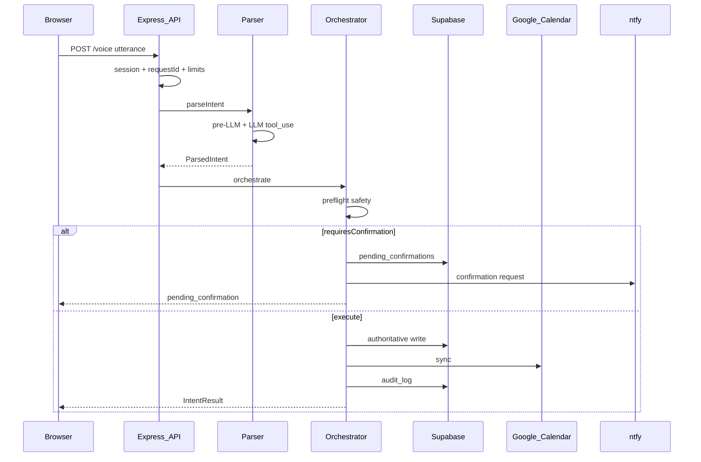
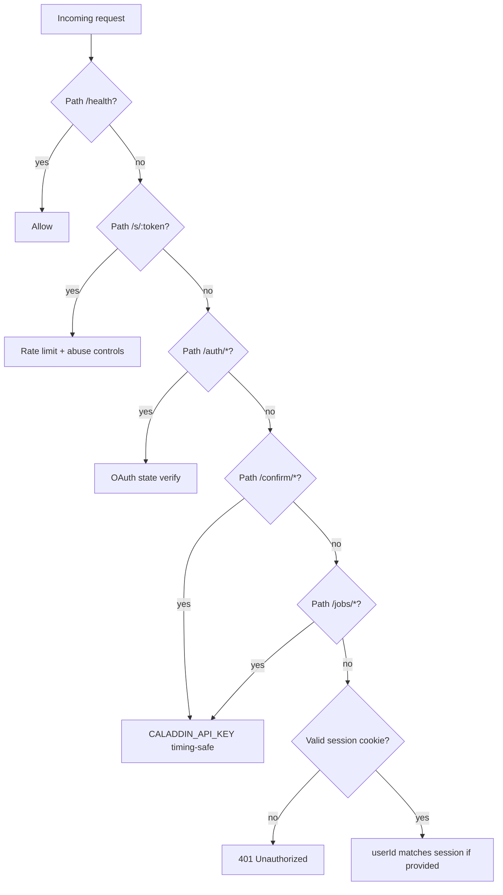
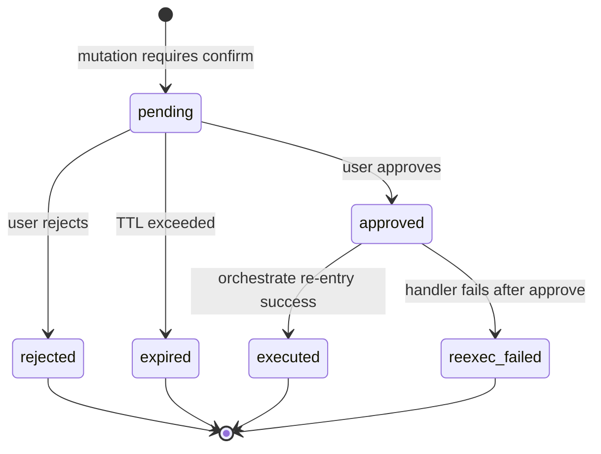
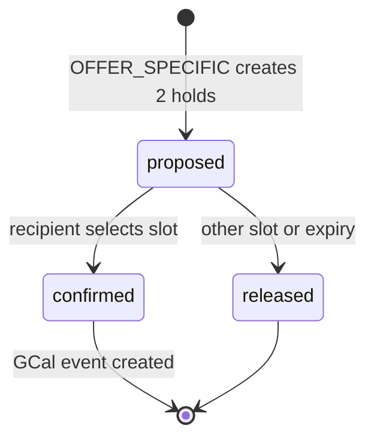
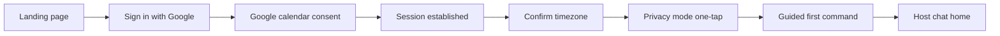

# Caladdin — Full Application Technical Specification

**Version:** 1.0  
**Date:** May 27, 2026  
**Status:** Canonical master spec for greenfield build, MVP ship, and production operations.  
**Audience:** Engineers, Cursor agents, QA, operators.

**Notation:**

- **MUST** / **MUST NOT** — mandatory.
- **SHOULD** — strong default; deviations require a recorded reason in `DECISIONS.md`.

---

## How to use this document

This is the **single document** required to build, deploy, test, and operate a fully functioning Caladdin MVP (10 trusted users) plus production hardening. It synthesizes:

- `CALADDIN_MVP_SPEC_V4_1.md` (product)
- `CALADDIN_INTENT_ARCHITECTURE_V5.md` (intents)
- `CALADDIN_TECH_SPEC.md` (backend contract)
- `CALADDIN_F1F5_TOP1PCT_PROMPT.md` (hardening)
- `CALADDIN_MASTER_INDEX.md` (infra reality)
- `CALADDIN_PRODUCT_VISION_V2.md` (non-normative context only)

For narrative vision and economics, see Product Vision v2. For backend-only quick reference, see `CALADDIN_TECH_SPEC.md`.

---

# Part 0 — Meta

## 0.1 Document precedence (conflict resolution)

When sources disagree, apply this order:

1. **Product truth:** MVP Spec v4.1, Intent Architecture v5.
2. **This document** — full application contract.
3. **Archived hardened spec / deltas / Phase X** — procedural detail inlined here and in Appendix A; intent count is always **10 + RESOLVE_MANUAL**, never legacy “8 intents”.
4. **F1–F5 prompt** — normative for hardening; **auth language in F5 remapped** to session-first users (§3).

## 0.2 Glossary

| Term | Definition |
|------|------------|
| **Cal-language** | Natural English strictly about time and calendar. |
| **Warm redirect** | Friendly nudge for off-topic input; not `RESOLVE_MANUAL`. |
| **Fax Effect** | Recipient page with exactly **two** offered slots; minimal AI branding. |
| **Shadow block** | Proposed calendar hold (`status='proposed'`) until recipient selects or session expires. |
| **Tier** | 0–3 priority on events/contacts; stored in Supabase, not GCal. |
| **Blast radius** | Count of events affected; >5 forces confirmation. |
| **Compensation queue** | Deferred GCal sync after successful Supabase write. |

## 0.3 Current implementation reality (gap checklist)

Reference state from Master Index (Phase 1 codebase on `github.com/kmiriyala/caladdin`):

| Area | Status |
|------|--------|
| Supabase core tables (6 + google_tokens) | Done |
| Phase 1 backend (28 files, 95 tests, ~94% coverage) | Done |
| Parser / PROTECT_BLOCK voice path | Partially working |
| Google OAuth end-to-end | **Not working** |
| Real GCal writes (oauthClient → orchestrator) | **Not working** |
| Confirmation re-execute on approve | **Not working** |
| ntfy Approve/Reject with public URL + API key | **Not working** |
| Web frontend / onboarding | **Not built** |
| Fax Effect recipient page | **Not built** |
| Session auth (Option 3) fully on all routes | **Spec frozen; code incomplete** |
| F1–F5 + Phase X tables | **Backlog** |

**Pre-launch blockers (MUST fix before first real user):** 12 integration bugs (Appendix B), OAuth E2E, confirm re-exec, spec-frozen PIVOT_ASYNC modes A/B/C in product UX.

---

# Part 1 — Product contract (normative)

## 1.1 What Caladdin is (MVP)

A scheduling assistant that accepts **voice or typed** Cal-language and safely orchestrates reads and mutations against **Google Calendar**, with **Supabase** as system of record for policy, mirrored events, audit, confirmations, and failure telemetry.

**MVP goal:** 10 friends click a link, connect Google Calendar, manage schedule in plain English, set up 1:1 appointments. Nothing bad happens to their calendars. They are delighted.

**Non-goals (MVP):** Autonomous agent, financial advisor, social network, Calendly clone, admin panel, billing, 3+ person scheduling, email body harvesting, Level-6 autonomy.

## 1.2 Six MVP requirements (release gates)

| # | Requirement | Ship criterion |
|---|-------------|----------------|
| 1 | Click link, Sign in with Google, no downloads | Onboarding flow live |
| 2 | Connect Google Calendar (urge test account; protect real) | OAuth + token refresh E2E |
| 3 | Speak or type English to manage calendar | `POST /voice` + chat UI |
| 4 | Manage own calendar | All mutation intents + safety |
| 5 | 1:1 appointments with friends | OFFER_SPECIFIC + `/s/:token` |
| 6 | Nothing bad happens to calendars | Tier + confirmation invariants |

## 1.3 Onboarding and first win

**Flow:** Link → landing → “Sign in with Google” → Google consent (calendar scopes) → session cookie → guided first command.

**Copy requirements:**

- Proactive “Why does Caladdin need calendar access?”
- OAuth failure: human message, retry CTA
- Declined calendar: explain requirement, offer retry
- **Urge test Gmail**; safety layer MUST protect real calendars regardless

**First win:** User completes one successful calendar action (block, move, or scheduling link sent) within **5 minutes** of connecting calendar. If not, onboarding failed.

## 1.4 Cal-language rules

**In scope:** Plain English about time/calendar only.

**Off-topic → warm redirect** (no LLM, no harsh error):

> Good to know! Anything I can help you with? Your calendar? Setting up a time with a friend?

**`RESOLVE_MANUAL` only for:** ambiguous Cal-language, multi-step bundles (v1: propose step 1), confidence/safety failures — **not** idle chat.

## 1.5 Ambiguity handling

One precise clarifying question — never a help menu.

Examples:

- “Clear Friday” → “Just this coming Friday, or every Friday?”
- “Move that” → “Which event — your 3pm standup or the Alex call?”

## 1.6 Success criteria (MVP exit)

| # | Criterion | Target |
|---|-----------|--------|
| 1 | Onboarding without founder help | 10/10 users |
| 2 | First win < 5 min after connect | 10/10 |
| 3 | ≥1 1:1 appointment scheduled per user | 10/10 |
| 4 | Zero Tier 0 mutations without confirmation | 0 violations |
| 5 | Zero delete→create class bugs | 0 violations |
| 6 | RESOLVE_MANUAL rate week 2 | < 10% |
| 7 | Off-topic warm redirect verified | Pass |
| 8 | ≥1 organic recipient signup | k > 0 |
| 9 | Satisfaction | ≥ 4.0 / 5 |
| 10 | Schema validator green on merge | 100% |
| 11 | All tests pass before push | 100% |

## 1.7 Build order (phased delivery)

**Phase 1 — Core loop (solo user):**

1. GCal → Supabase event sync  
2. QUERY_CALENDAR  
3. CREATE_EVENT  
4. Warm redirect  
5. Ambiguity in LLM prompt  
6. Host chat UI (founder dogfood)  
7. Onboarding flow  

**Phase 2 — Viral layer:**

8. Shadow blocks  
9. OFFER_SPECIFIC + free/busy slot generation  
10. Recipient Fax Effect page  
11. Post-selection viral CTA  
12. Feedback (thumbs + weekly)  

**Phase 3 — 10 users:**

13. Founder tests 12+ utterances per intent  
14. Fix breaks  
15. Invite 10 friends  

---

# Part 2 — System architecture

## 2.1 High-level pipeline

Every user command:

1. **Ingress** — Session auth; body size / utterance bounds.  
2. **Parse** — Pre-LLM validation; single LLM `classify_intent` tool call; Zod on output.  
3. **Preflight safety** — Tiers, destructive flag, blast radius.  
4. **Orchestrate** — One intent handler; catch errors → `IntentResult`.  
5. **Persist** — Mutations: **Supabase first**, GCal second; compensation on GCal failure.  
6. **Respond** — Fax-style `messageToUser`; HTTP envelope.  
7. **Audit** — `audit_log` always; `failure_logs` when required.



## 2.2 Trust boundaries

| Zone | Holds | MUST NOT |
|------|--------|----------|
| Browser | Session cookie; OAuth UX | `CALADDIN_API_KEY` |
| App server | LLM keys, DB, OAuth secret, signing keys | Expose secrets in responses |
| Public recipient | `/s/:token` scheduling only | Host policy or unrelated data |

## 2.3 External dependencies

| Service | Role |
|---------|------|
| Anthropic | Intent classification (Haiku-class recommended) |
| Google Calendar + OAuth | Calendar truth on Google; per-user tokens |
| Supabase Postgres | Policy, events mirror, audit, sessions, confirmations |
| ntfy | Human confirmations; machine callbacks to `/confirm` |

## 2.4 Component map

| Layer | Path (conventional) | Responsibilities |
|-------|---------------------|------------------|
| Web client | `web/` or `public/` | Onboarding, chat, session, reconnect banner |
| API server | `src/index.ts`, `src/routes/` | Routes, middleware, rate limits, `requestId` |
| Parser | `src/core/parser.ts` | Pre-LLM, tool use, Zod |
| Orchestrator | `src/core/orchestrator.ts` | Routing, confirmation gates |
| Handlers | `src/handlers/*.ts` | One file per intent (×10) |
| Safety | `src/core/safety.ts` | Tiers, blast radius, rate limiter factory |
| Services | `src/services/auth_service.ts`, `calendar_api.ts` | OAuth, GCal API |
| DB | `src/db/*.ts` | Supabase accessors |
| Jobs | `src/jobs/`, `src/routes/jobs.ts` | Improvement loop |
| Migrations | `supabase/migrations/` | DDL source of truth |

## 2.5 Persistence ordering (normative)

For all mutations:

1. Write authoritative state to **Supabase**.  
2. Attempt **Google Calendar** sync.  
3. On GCal failure after Supabase success: **MUST NOT** roll back Supabase solely for sync failure; **SHOULD** enqueue `compensation_queue` (Appendix A).  
4. User message: “Saved to Caladdin. Your Google Calendar will sync shortly.”

---

# Part 3 — Authentication and authorization

## 3.1 Principles

- **Human users (chat/web):** Google Sign-In for identity + Calendar OAuth scopes → **HTTP-only session cookie** binding Caladdin `userId`. Body `userId` if present **MUST** match session.  
- **`CALADDIN_API_KEY`:** **MUST** for machine routes only (`/confirm/*`, `/jobs/*`, ntfy Action callbacks). **MUST NOT** be primary auth for `/voice` or host JSON APIs.

## 3.2 Route classes



| Route class | Paths | Auth |
|-------------|-------|------|
| Public health | `GET /health` | None |
| User OAuth | `/auth/start`, `/auth/callback` | Signed `state`; session on callback |
| User command | `POST /voice`, `/api/*`, `/feedback` | Session cookie |
| Recipient | `GET/POST /s/:token/*` | Public + rate limit |
| Machine | `/confirm/:token/*`, `POST /jobs/*` | `x-api-key` timing-safe |
| Logout | `DELETE /auth/session` | Session |

## 3.3 OAuth flow

1. `GET /auth/start` — redirect to Google with `state` (signed, CSRF-safe).  
2. `GET /auth/callback` — verify `state`, exchange code, persist tokens (**Supabase primary + disk cache** for googleapis refresh).  
3. Create/update `users` row; issue session cookie.  
4. On revoked tokens: detect on GCal probe → reconnect banner (Part 8).

## 3.4 Session implementation

**MAY** use `express-session` + Supabase store **OR** signed opaque cookie; both satisfy browser session binding.

**Logout:** `DELETE /auth/session` clears cookie and server session record.

## 3.5 Security test remapping (F5)

Legacy “no API key on `/voice` → 401” **MUST** be reinterpreted as:

- Unauthenticated `/voice` (no valid session) → **401** `{ error: 'Unauthorized' }`  
- No downstream LLM/DB calls  

Machine routes retain API key attacks (timing-safe `crypto.timingSafeEqual`).

---

# Part 4 — Intent catalog (normative)

## 4.1 Closed set

Classifier **MUST** output exactly one primary label among **10 intents** or `RESOLVE_MANUAL`.

| Intent | Typical mutation | Autonomy (MVP) |
|--------|------------------|----------------|
| `PROTECT_BLOCK` | YES | L4 with confirmation when destructive |
| `OFFER_SPECIFIC` | YES (sessions + proposed holds) | L3 draft / L4 confirm |
| `CREATE_EVENT` | YES | L4 |
| `FLUSH_RANGE` | YES | L4 always |
| `MODIFY_EVENT` | YES | L4; scope param |
| `PIVOT_ASYNC` | MAY | L3–L4 by mode |
| `SHAPE_RULES` | YES (policy) | L4 |
| `GATEKEEP_RULE` | YES (policy) | L4 |
| `QUERY_CALENDAR` | NO | L1 |
| `UNDO` | YES (windowed) | L4 |
| `RESOLVE_MANUAL` | NO | Escalation only |

## 4.2 Per-intent definitions

### PROTECT_BLOCK

Recurring or one-off protected time. No external party.

**Examples:** “Block Tuesday mornings for deep work”, “Protect my lunch every day”

**Params (logical):** `label`, `daysOfWeek[]`, `startTime`, `endTime`, `recurrence?`, `timezone`

**Confirmation:** Tier 0 overlap → confirm; destructive pre-filter → confirm.

---

### OFFER_SPECIFIC

Find ≤2 scored slots; create scheduling link; shadow blocks.

**Examples:** “Find 2 slots for Alex next week”, “Book a haircut”

**Params:** `recipientName?`, `recipientEmail?`, `durationMinutes`, `rangeStart`, `rangeEnd`, `context?`, `posture?: 'strict'|'mutual'|'flexible'`

**Behavior:**

1. Score slots (Fax weights §7.4); pick top 2.  
2. Insert `scheduling_sessions`; soft-block both on host calendar (`status='proposed'`).  
3. Return link `https://caladdin.app/s/{token}` (or `CALADDIN_BASE_URL`).  
4. Expiry default **72h**.

**Read-only phases** (slot search) SHOULD NOT consume mutation rate budget.

---

### CREATE_EVENT

Explicit placement at known time.

**Examples:** “Put dinner with Sarah at 7pm Friday”, “Add dentist Tuesday 2pm”

**Params:** `title`, `start`, `end`, `participants[]?`, `location?`, `description?`

---

### FLUSH_RANGE

Cancel/clear events in window.

**Examples:** “Cancel tomorrow”, “Clear Friday except board call”

**Params:** `rangeStart`, `rangeEnd`, `exceptions[]?` (event ids or titles)

**Confirmation:** Tier 0/1 affected, blast >5, or destructive pre-filter.

---

### MODIFY_EVENT

**Params:** `eventId?`, `eventTitle?`, `newStart?`, `newEnd?`, `scope: 'single'|'this_and_future'|'series'` (default `single`)

**Examples:** “Move my 3pm to 4pm” → single; “Change standup to Thursdays” → series

---

### PIVOT_ASYNC

| Mode | User signal | Behavior |
|------|-------------|----------|
| **A** Decline + reschedule | “can't make it, find other times” | Decline copy + OFFER_SPECIFIC alternates |
| **B** Decline only | “Decline Sarah's invite” | Decline message; no slots |
| **C** Block + silent | “Block this person, don't tell them” | GATEKEEP blocked tier; no outbound message |

**Params:** `mode: 'A'|'B'|'C'`, `contact`, `message?`, `originalEventId?`

**MVP limitation:** External channel delivery may be manual copy — disclose to testers (Appendix B).

---

### SHAPE_RULES

Time preferences affecting future slot generation.

**Params:** `rules[]` — e.g. `noMeetingsBefore`, `bufferMinutes`, `maxMeetingsPerDay`, `fridayAfternoonFree`

---

### GATEKEEP_RULE

Contact/domain tiering.

**Params:** `contact` (email or domain), `tier: 0|1|2|3`

Map: “high priority” → 1, “sacred” → 0, “flexible” → 3

---

### QUERY_CALENDAR

Read-only summary.

**Params:** `rangeStart?`, `rangeEnd?`, `query?` (e.g. “free Thursday 2pm”)

**Default window:** next 24–72 hours in user TZ.

---

### UNDO

Revert last eligible action within **10 minutes**.

**Supported:** `MODIFY_EVENT` (single), `CREATE_EVENT`, `PROTECT_BLOCK`  
**NOT supported:** `FLUSH_RANGE`, `OFFER_SPECIFIC` (link may be sent)

**Social context:** If external participants notified → warn before undo.

```typescript
async function checkSocialContext(lastAction: AuditEntry): Promise<{
  safe: boolean
  warningMessage?: string
}> {
  const event = lastAction.eventId ? await getEventById(lastAction.eventId) : null
  if (!event) return { safe: true }
  const hasExternal = event.participants.some(p => !isHostDomain(p))
  if (hasExternal) {
    return {
      safe: false,
      warningMessage: `This may notify ${event.participants.join(', ')}. Proceed?`,
    }
  }
  return { safe: true }
}
```

---

### RESOLVE_MANUAL

Triggers: confidence < 0.60, multi-step detected, parse/Zod failure, unsafe ambiguity.

**User sees:** Warm message + 2–3 example commands. Log to `failure_logs`.

## 4.3 Multi-step (v1)

Detect multi-intent utterance → `RESOLVE_MANUAL`:

> I can do that in two steps. First I'll [action 1]. Want me to start there?

Full chained executor **deferred** post-MVP.

## 4.4 Parser rules

### Pre-LLM (MUST run before LLM)

1. `userId` — canonical UUID or reject **400** before DB.  
2. `utterance` — trim, non-empty, max **1000** chars or **400** before LLM.  
3. Off-topic — warm redirect handler (**no LLM**).  
4. Destructive pre-filter: `DESTRUCTIVE_VERB_RE = /\b(delete|cancel|remove|clear|drop|erase|wipe)\b/i` → `_destructivePreFilter=true` → still classify → orchestrator forces `requiresConfirmation=true`.

### LLM tool contract

```typescript
const CLASSIFY_INTENT_TOOL = {
  name: 'classify_intent',
  input_schema: {
    type: 'object',
    properties: {
      intent: {
        type: 'string',
        enum: [
          'PROTECT_BLOCK', 'OFFER_SPECIFIC', 'CREATE_EVENT', 'FLUSH_RANGE',
          'MODIFY_EVENT', 'PIVOT_ASYNC', 'SHAPE_RULES', 'GATEKEEP_RULE',
          'QUERY_CALENDAR', 'UNDO', 'RESOLVE_MANUAL',
        ],
      },
      confidence: { type: 'number', minimum: 0, maximum: 1 },
      params: { type: 'object' },
      mappingMethod: { type: 'string', enum: ['direct', 'fuzzy', 'resolve_manual'] },
    },
    required: ['intent', 'confidence', 'params', 'mappingMethod'],
  },
}
```

**MUST** Zod-validate tool output after API returns.

### Confidence routing

| Condition | mappingMethod | Intent |
|-----------|---------------|--------|
| confidence ≥ 0.85, not manual | `direct` | as classified |
| 0.60 ≤ confidence < 0.85 | `fuzzy` | as classified + log hint |
| < 0.60 or forced | `resolve_manual` | `RESOLVE_MANUAL` |

`_destructivePreFilter` does not change label but forces confirmation downstream.

**LLM timeout:** ~10s → friendly retry message; prefer **503** with `Retry-After` if no deterministic fallback succeeded.

---

# Part 5 — Safety and confirmations

## 5.1 Tier table

| Tier | Label | Rule |
|------|-------|------|
| 0 | Sacred | **MUST NOT** mutate without explicit confirmation |
| 1 | High-stakes | Confirm destructive ops |
| 2 | Standard | Allow with audit |
| 3 | Flexible | Allow with audit |

**Default** imported GCal events: Tier 2 until promoted via SHAPE_RULES/GATEKEEP.

**Blast radius:** >5 events → `requiresConfirmation=true` regardless of tier.

## 5.2 Destructive invariant

**“delete” is NEVER re-interpreted as “create.”** Ambiguous destructive utterance → `RESOLVE_MANUAL`. When in doubt → ask.

## 5.3 Explicit confirmation

Affirmative tokens: `yes`, `confirm`, `ok`, `sure`, or Approve tap. Silence does not count. Expiry: **10 minutes** default.

## 5.4 Confirmation state machine



**APPROVED path MUST:**

1. Mark row `approved` (before re-exec).  
2. Reconstruct payload; verify `payload_hash` — mismatch → **409**.  
3. Re-enter orchestrator with `_skipConfirmationGate=true`.  
4. On handler failure after approval: **200** with `executionStatus: 'failed'`, audit `outcome='failed'`, ntfy user — **MUST NOT** spurious **500** for approval itself.

**Double approve:** second call → **409** `Token already consumed`.

**Expired token:** **410** `Token expired`.

## 5.5 Rate limiting

Rolling **60-minute sliding window**: **20 mutations per user**.

Export `createRateLimiter(maxRequests, windowMs)` for tests; `globalRateLimiter = createRateLimiter(20, 3600000)`.

**429** body: `{ error: 'Rate limit exceeded. Max 20 mutations per hour.', retryAfterMs }`

READ intents (`QUERY_CALENDAR`; read-only OFFER_SPECIFIC phases) SHOULD NOT count toward mutation budget.

---

# Part 6 — APIs (normative)

**Global rules:**

- JSON body limit **≤ 10 KB** (`express.json({ limit: '10kb' })`).  
- All user-facing errors sanitized — no stacks, `"supabase"`, paths, secrets.  
- Response header `x-request-id` on primary APIs (P1).  
- UUID `userId` validation before any DB call.

## 6.1 `GET /health`

**Auth:** None  

**200:**

```json
{ "status": "ok", "version": "1.0.0" }
```

## 6.2 `GET /auth/start`

**Auth:** None (may require session for reconnect)

**Behavior:** Redirect 302 to Google OAuth with signed `state`.

## 6.3 `GET /auth/callback`

**Query:** `code`, `state`

**Behavior:** Verify `state`, exchange tokens, upsert user, set session cookie, redirect to app home.

**Errors:** Human-readable HTML or JSON — never raw Google error blobs.

## 6.4 `DELETE /auth/session`

**Auth:** Session  

**200:** `{ "ok": true }` — clears cookie.

## 6.5 `POST /voice`

**Auth:** Session cookie (**not** API key)

**Body:**

```json
{
  "utterance": "Block Tuesday mornings for deep work"
}
```

**200 (success):**

```json
{
  "intent": "PROTECT_BLOCK",
  "success": true,
  "requiresConfirmation": false,
  "messageToUser": "Tuesday mornings are now protected for deep work.",
  "eventsAffected": 0,
  "schemaVersion": 1
}
```

**200 (pending confirmation):**

```json
{
  "intent": "FLUSH_RANGE",
  "success": false,
  "requiresConfirmation": true,
  "confirmationToken": "uuid-token",
  "messageToUser": "This will cancel 8 events on Friday. Confirm?"
}
```

**400:** Invalid UUID, utterance too long, malformed body  

**401:** No session  

**404:** User/policy not found (no DB structure leak)  

**429:** Rate limit  

**503:** Supabase/LLM unavailable per §9  

**Headers:** `x-request-id: <uuid>`

## 6.6 `GET /s/:token`

**Auth:** Public + rate limit

**Behavior:** Render Fax Effect HTML (Part 8). **200** page or **410** expired session.

## 6.7 `POST /s/:token/select`

**Body:**

```json
{ "slotIndex": 0 }
```

**Behavior:** Confirm selected shadow block; release other; create GCal event; mark session `booked`.

**409:** Slot no longer available → graceful copy + notify host.

## 6.8 `POST /s/:token/propose`

**Body:** `{ "message": "None of these work" }` — optional recipient feedback; notify host.

## 6.9 `POST /confirm/:token/approve` | `reject`

**Auth:** `x-api-key: CALADDIN_API_KEY` (ntfy Action)

**Approve 200:**

```json
{
  "status": "approved",
  "executionStatus": "success"
}
```

**Approve 200 (re-exec failed):**

```json
{
  "status": "approved",
  "executionStatus": "failed",
  "reason": "Google Calendar API unavailable"
}
```

**409:** Stale payload hash or already consumed  

**410:** Expired  

**404:** Token not found

## 6.10 `GET /api/sessions`

**Auth:** Session  

**200:** List host's `scheduling_sessions` (open/booked/expired).

## 6.11 `POST /feedback`

**Auth:** Session  

**Body:**

```json
{
  "rating": "up",
  "intent": "CREATE_EVENT",
  "comment": null
}
```

## 6.12 `POST /jobs/improvement-loop`

**Auth:** API key  

**Body:**

```json
{ "lookbackDays": 7, "minFailuresPerGroup": 3 }
```

**200:**

```json
{
  "status": "complete",
  "failuresAnalyzed": 42,
  "groupsAnalyzed": 5,
  "reportPath": "IMPROVEMENT_REPORT.md"
}
```

---

# Part 7 — Data model

## 7.1 Zod schemas (source of truth)

**Core types:** `ParsedIntent`, `IntentResult`, `UserPolicyProfile`, `CalendarEvent`, `FailureLogEntry`, `PendingConfirmation`

**IntentResult (logical minimum):**

```typescript
{
  intent: IntentEnum
  success: boolean
  requiresConfirmation: boolean
  messageToUser: string
  confirmationToken?: string
  slots?: Slot[]           // OFFER_SPECIFIC
  eventsAffected?: number
  schemaVersion?: number
}
```

**UserPolicyProfile:** MUST include `schemaVersion: number` default `1`; load path runs `migratePolicy()` when older.

## 7.2 Table catalog

### Core (migration 001)

**users**

| Column | Type | Notes |
|--------|------|-------|
| id | UUID PK | Caladdin user id |
| email | TEXT UNIQUE | From Google |
| display_name | TEXT | |
| timezone | TEXT | IANA default |
| privacy_mode | TEXT | private \| trusted \| open |
| created_at | TIMESTAMPTZ | |

**user_policies**

| Column | Type | Notes |
|--------|------|-------|
| user_id | UUID FK → users | |
| profile | JSONB | UserPolicyProfile |
| updated_at | TIMESTAMPTZ | |

**events**

| Column | Type | Notes |
|--------|------|-------|
| id | UUID PK | |
| user_id | UUID FK | |
| gcal_event_id | TEXT | nullable |
| title | TEXT | |
| start_at | TIMESTAMPTZ | |
| end_at | TIMESTAMPTZ | |
| tier | SMALLINT | 0–3 |
| status | TEXT | confirmed \| cancelled \| proposed |
| participants | JSONB | |
| is_recurring | BOOLEAN | |
| proposed_for_session | UUID | nullable FK → scheduling_sessions |

**failure_logs**, **audit_log**, **pending_confirmations** — per hardened spec; `pending_confirmations.payload_hash` (migration 004).

### Tokens (002+)

**google_tokens** — `user_id`, `access_token`, `refresh_token`, `expiry`, encrypted at rest where supported.

### Scheduling (007)

**scheduling_sessions**

| Column | Type |
|--------|------|
| id | UUID PK |
| token | UUID UNIQUE |
| host_user_id | UUID FK |
| slots | JSONB |
| host_name | TEXT |
| context | TEXT |
| posture | strict \| mutual \| flexible |
| status | open \| booked \| expired |
| proposed_event_ids | UUID[] |
| created_at | TIMESTAMPTZ |
| expires_at | TIMESTAMPTZ |

### Other

**feedback_logs** (008), **usage_events** (011), **pending_clarification_frames** (013)

### Phase X / production backlog (normative before prod scale)

**compensation_queue** — `id`, `user_id`, `operation`, `payload JSONB`, `attempts`, `next_retry_at`, `created_at`

**idempotency_keys** — `key_hash`, `user_id`, `intent`, `bucket_5min`, `expires_at` (24h TTL)

**shadow_requests** / **shadow_diffs** — staging replay only; **MUST NOT** run shadow replay in production.

**audit_log.previous_state** — JSONB snapshot for UNDO.

## 7.3 Fax Effect scoring

Weighted factors MUST sum to **exactly 1.0**. Baseline correction: `energyWeight = 0.50`.

Factors (illustrative): energy alignment, focus protection, relationship tier, recency of offers.

## 7.4 Slot generation

- Grid: **30-minute** steps  
- Window: user working hours **09:00–18:00** in user TZ  
- Horizon: **~7 days**  
- Exclude: busy intervals, Tier 0 blocks, existing proposed holds  
- Return: **≤ 2** slots

## 7.5 Shadow block lifecycle



- Label on calendar: `[Proposed] Slot for {Name}`  
- Host books over proposed → warn: “You offered this time to {Name}. Book anyway?”  
- Expiry **72h** → release both + notify host

---

# Part 8 — User-facing surfaces (normative)

## 8.1 Design system (Fax Effect + host app)

| Token | Value |
|-------|-------|
| Body font | DM Sans |
| Heading font | Fraunces (serif) |
| Palette | Stone / amber — warm, not corporate |
| Layout | Mobile-first |
| Branding on recipient page | **None** — no “powered by”, no AI language |

## 8.2 Onboarding flow



**Screens:**

1. **Landing** — one-line pitch: “Talk to your calendar like you talk to a smart friend.” CTA: Sign in with Google.  
2. **Post-OAuth** — “You're connected.” Show calendar email; urge test account note in small copy.  
3. **Timezone** — pre-fill from browser; allow change.  
4. **Privacy mode** — Private (default) | Trusted | Open — one tap, no overload.  
5. **First win** — suggest: “What's on my calendar today?” or “Block tomorrow morning for focus.”  
6. **Success state** — celebrate first action; show thumbs feedback once.

**OAuth failure:** inline error + “Try again” — no stack traces.

**Reconnect banner:** persistent when tokens revoked — “Your calendar connection needs to be refreshed.” → `/auth/start`

## 8.3 Host chat UI

**Components:**

- Message list (user utterances + Caladdin `messageToUser`)  
- Text input + optional voice (Wispr Flow or Web Speech → text)  
- Confirmation card when `requiresConfirmation` — Approve / Reject inline **or** via ntfy  
- Thumbs up/down after completed actions (optional, one tap)  
- Weekly prompt modal: 1–5 stars + optional comment (skippable)

**Session:** all API calls include credentials; no client-side API key.

## 8.4 Fax Effect recipient page (`GET /s/:token`)

**Above fold:**

- Host name (e.g. “Kanth”)  
- Optional personal note from host  
- Meeting duration  
- **Exactly 2** time options — buttons, not a grid  
- No signup before selection  

**After selection:**

- Green confirmation panel with chosen time  
- Single soft line: “Want this for your own calendar?” + **Join Caladdin** button  
- No modal, countdown, or FOMO  

**Slot unavailable:**

> These times are no longer available. {Host} will send new options shortly.

Host notified via ntfy/email hook.

**Anti-patterns (MUST NOT):**

- Calendly-style grid  
- AI branding or “algorithm” language  
- Signup gate before picking a slot  

## 8.5 Error UX copy (user-visible)

| Condition | Copy |
|-----------|------|
| Supabase down | Caladdin is temporarily unavailable. Try again in 30 seconds. |
| LLM limited mode | I'm running in limited mode right now. Basic commands still work. |
| GCal sync delayed | Saved to Caladdin. Your Google Calendar will sync shortly. |
| LLM slow | Taking a moment longer than usual. Try again? |
| OAuth revoked | Your calendar connection needs to be refreshed. [Reconnect] |

---

# Part 9 — Reliability and degradation

## 9.1 Unified degradation matrix

| Dependency state | Behavior | HTTP |
|------------------|----------|------|
| Supabase unreachable | Fail safe; no durable audit | **503** + `Retry-After: 30` |
| LLM unreachable | DEGRADED_LLM: keyword shim for low-risk intents only; unknowns → safe message | **503** OR **200** limited-mode if shim succeeded — **document choice in DECISIONS.md** |
| GCal down after Supabase OK | Enqueue compensation; success semantics to user | **200** + sync flag in message |
| ntfy down | Log; non-blocking | Parent op succeeds |
| OAuth revoked/missing | Reconnect banner; no silent failure | **401**/host guidance |
| Utterance LLM stall (>10s) | Timeout + retry prompt | **504** or **503** |

## 9.2 SAFE_MODE

When **LLM + Calendar** both unavailable simultaneously:

- Restrict to read-only paths where possible  
- **MUST NOT** proceed with destructive mutations  
- User copy explains limited mode clearly  

## 9.3 Compensation worker (Phase X)

Background job (cron or queue consumer):

1. Poll `compensation_queue` where `next_retry_at <= now()`  
2. Retry GCal operation with exponential backoff  
3. Max attempts → alert via ntfy + `failure_logs`  
4. Idempotent retries (P3)

---

# Part 10 — Observability and operations

## 10.1 Request tracing (P1)

- Generate UUID `requestId` at `/voice` (and primary API) entry  
- Propagate via `OrchestratorContext` through parser → handler → DB → ntfy  
- Log structured field `{ requestId, userId, intent }`  
- Persist `requestId` on `audit_log` rows  
- Return header `x-request-id`

## 10.2 Logging and audit

**audit_log** — every intent outcome: `success`, `blocked`, `pending_confirmation`, `failed`; include `intent`, `user_id`, `request_id`, optional `telemetry JSONB` (latency, deps).

**failure_logs** — parse failures, RESOLVE_MANUAL, LLM errors; nullable `attemptedIntent`, `confidence`.

**Retention (MVP):** indefinite in Supabase; export before scale review.

## 10.3 Improvement loop (F4)

Pure functions: `groupFailuresByIntent`, `filterByDateRange`, `analyzePatterns`, `renderImprovementReport`.

Orchestrator `runImprovementLoop` → writes markdown report; ntfy optional; **never throws** on ntfy failure.

Trigger: `POST /jobs/improvement-loop` weekly (cron) or manual.

## 10.4 Deployment

### Stack

| Component | Technology |
|-----------|------------|
| API | Node.js + Express (TypeScript) |
| Frontend | Static SPA or lightweight SSR served by Express |
| Database | Supabase hosted Postgres |
| Secrets | Environment variables / host secret store |
| Push | ntfy topics per user/build |

### Environment variables (required)

| Variable | Purpose |
|----------|---------|
| `ANTHROPIC_API_KEY` | LLM classification |
| `SUPABASE_URL` | Postgres + auth URL |
| `SUPABASE_ANON_KEY` | Client-side if needed |
| `SUPABASE_SERVICE_ROLE_KEY` | Server DB writes |
| `GOOGLE_OAUTH_CLIENT_ID` | OAuth |
| `GOOGLE_OAUTH_CLIENT_SECRET` | OAuth |
| `GOOGLE_REDIRECT_URI` | Must match Google console |
| `CALADDIN_BASE_URL` | Public URL (ngrok dev, HTTPS prod) |
| `CALADDIN_API_KEY` | Machine routes |
| `SESSION_SECRET` | Session signing |
| `NODE_ENV` | production \| development |

### Local development

- `npm run dev` — API + frontend  
- **ngrok** tunnel for ntfy Action URLs → `/confirm/*`  
- ntfy iPhone app subscribed to user topic (e.g. `caladdin-fkikgtxh`)

### Production checklist

- [ ] HTTPS only (cookies `Secure`, `HttpOnly`, `SameSite=Lax`)  
- [ ] `express.json({ limit: '10kb' })`  
- [ ] Health check monitored (`GET /health`)  
- [ ] Supabase migrations applied through latest  
- [ ] Google Cloud OAuth redirect URIs match prod domain  
- [ ] Rate limiter enabled globally on mutation routes  
- [ ] Error sanitization middleware on all 5xx  

## 10.5 Smoke test protocol (pre-invite)

1. OAuth sign-in with test Google account  
2. **12 utterances** minimum (≥1 per intent + warm redirect + RESOLVE_MANUAL)  
3. One full OFFER_SPECIFIC → recipient select → GCal event created  
4. One destructive FLUSH_RANGE → confirm → approve → verify re-exec  
5. UNDO within 10 min on CREATE_EVENT  
6. Simulate GCal failure → verify compensation message  
7. Run F3 simulation suite green  
8. Run F5 red team suite green  

---

# Part 11 — Privacy and compliance

## 11.1 Data access (canonical)

| Data | Caladdin access |
|------|-----------------|
| Calendar events | Titles, times, participants via OAuth |
| Email body | **Never** |
| Attachments | **Never** |
| Contact list | Only explicit upload (post-MVP) |
| LLM input | **Utterance text only** — no calendar blobs on default path |

## 11.2 Privacy modes (signup)

1. **Private** — only user sees data (default)  
2. **Trusted** — scheduling partners see availability  
3. **Open** — link holders see free/busy  

No-visibility list for people/domains from day one.

## 11.3 MVP prohibitions

- No cross-user data sharing  
- No behavioral profiling without awareness  
- No proactive external messages without confirmation  
- No financial/medical/legal advice  

---

# Part 12 — Testing and quality gates

## 12.1 Pre-merge gates

- All tests pass (`npm test`)  
- Schema validator green  
- Coverage target: **≥ 93%** (Phase 1 baseline)  
- No weakening validations to pass tests  
- Contract tests updated for **10 intents** (not 8)

## 12.2 Parser golden utterances

**MUST** cover all 10 intents + warm redirect + RESOLVE_MANUAL + destructive pre-filter + each PIVOT_ASYNC mode.

Examples:

| Utterance | Expected intent |
|-----------|-----------------|
| Block every Tuesday morning for deep work | PROTECT_BLOCK |
| Find 2 slots for Alex next week | OFFER_SPECIFIC |
| Put dinner with Sarah at 7pm Friday | CREATE_EVENT |
| Cancel tomorrow | FLUSH_RANGE |
| Move my 3pm to 4pm | MODIFY_EVENT |
| Decline the call from Sarah | PIVOT_ASYNC mode B |
| No meetings before 9am | SHAPE_RULES |
| Treat sarah@co.com as high priority | GATEKEEP_RULE |
| What's on my calendar today | QUERY_CALENDAR |
| Undo that | UNDO |
| My week is a mess help | RESOLVE_MANUAL |
| The weather is great | warm redirect (not RESOLVE_MANUAL) |

## 12.3 Contract tests (F2)

**tests/contracts/**

1. **parser-to-orchestrator** — synthetic `ParsedIntent` per intent; orchestrate accepts; destructive flag → `requiresConfirmation`  
2. **orchestrator-to-db** — each `IntentResult` outcome maps to audit/failure/confirmation inserts  
3. **intent-result-shape** — each handler return passes `IntentResultSchema`; negative paths return `success=false` not throw  

## 12.4 Pre-launch simulation (F3)

13 synthetic calendar events (tiers 0–3). **8 cases** with exact assertions:

1. PROTECT_BLOCK — policy upsert, no GCal without oauth  
2. FLUSH_RANGE Friday — pending confirmation, no cancel before approve  
3. OFFER_SPECIFIC — ≤2 slots, no tier-0 overlap  
4. MODIFY_EVENT standup — tier 2, no confirm  
5. Cancel meditation (tier 0) — confirm required  
6. Garbage input → RESOLVE_MANUAL + failure_log  
7. 1001-char utterance → 400, zero LLM/DB calls  
8. Invalid userId → 400, zero DB calls  

## 12.5 Red team suite (F5) — session-aware

| Attack | Expected |
|--------|----------|
| No session on `/voice` | 401, zero downstream |
| Utterance >1000 chars | 400, zero LLM |
| SQL injection userId | 400 |
| Non-UUID userIds | 400 each |
| Unknown UUID user | 404 sanitized |
| Polite destructive utterance | FLUSH_RANGE + confirm, no mutation |
| Expired confirm token | 410 |
| Double approve | 409 |
| Unknown confirm token | 404 |
| Rate limit 6th request | 429 + retryAfterMs |
| 11KB body | 400/413 |
| Forced DB error | 500 sanitized |
| API key timing | wrong vs missing within 10ms mean |

## 12.6 Property tests (optional bonus)

`fast-check`: parser never throws for strings ≤1000; intent always in enum; empty → RESOLVE_MANUAL.

---

# Appendix A — Hardening backlog (normative for production)

## Phase 0 — Discovery

Before large refactors: produce `REPO_STATE.md` — test counts, route map, Zod inventory, migration tables, adapter health, gaps vs this spec.

## P1 — Request tracing

Implement §10.1 fully before first external user.

## P2 — Graceful degradation

Implement §9.1 for Anthropic, Supabase, GCal, ntfy — no bare 500s for external faults.

## P3 — Mutation idempotency

| Intent | Rule |
|--------|------|
| PROTECT_BLOCK | Skip duplicate block (label + days + times) |
| FLUSH_RANGE | Skip already cancelled |
| MODIFY_EVENT | No-op if unchanged |
| SHAPE_RULES / GATEKEEP_RULE | Upsert idempotent |
| HTTP | Optional `Idempotency-Key` header → `idempotency_keys` table (5-min bucket, 24h TTL) |

## P4 — Confirmation re-execution failure

Implement §5.4 `reexec_failed` path; audit + ntfy on failure.

## P5 — Policy schema versioning

`schemaVersion` on `UserPolicyProfile`; `migratePolicy()` on load; document in `DECISIONS.md`.

## F1 — Decision log

`scripts/log-decision.ts` CLI → appends `DECISIONS.md` (never imported at runtime).

Pre-populated decisions:

1. Zod as single source of truth for types  
2. Tier in Supabase not GCal  
3. Session for humans; API key for machines  
4. Dual token storage: Supabase + disk cache  
5. Stateless confirm re-exec from `pending_confirmations` payload  
6. requestId at ingress  

## F2 — Contract tests

See §12.3 — bind to actual exports; update enums to 10 intents.

## F3 — Simulation

See §12.4 — `tests/fixtures/synthetic-events.ts`, `tests/simulation/pre-launch-sim.test.ts`.

## F4 — Improvement loop

See §10.3 — pure analysis functions + `POST /jobs/improvement-loop`.

## F5 — Red team

See §12.5 + security fixes:

- `express.json({ limit: '10kb' })`  
- `createRateLimiter` factory  
- UUID regex in validateUser  
- `src/middleware/auth.ts` timing-safe API key  
- Sanitized 5xx handlers  

## Phase X — Production operations

| Item | Requirement |
|------|-------------|
| Operation ordering | Supabase → GCal → compensation (§2.5) |
| compensation_queue | DDL + worker |
| idempotency_keys | DDL + middleware |
| Sliding-window rate limit | §5.5 |
| Chaos adapters | Env-guarded; non-prod only |
| Shadow replay | Staging only — **never** production |
| Telemetry on audit_log | Latency + dependency status JSON |
| audit_log.previous_state | UNDO snapshots |
| events.proposed_for_session | Shadow block FK |

**Branch policy for hardening:** work on `f1-f5-hardening`; never push directly to `main`.

---

# Appendix B — Known MVP limitations and pre-launch blockers

## B.1 Product limitations (disclosed to testers)

| # | Limitation | Handling |
|---|------------|----------|
| 1 | PIVOT external delivery undefined | Manual send of decline copy |
| 2 | ntfy Action exposes API key in header | Prototype risk; roadmap signed URLs |
| 3 | Imported events default Tier 2 | Explicit promotion via voice |
| 4 | Phase X DDL partial | Migrate before prod scale |
| 5 | Multi-step intents | Step 1 only via RESOLVE_MANUAL |
| 6 | 3+ person scheduling | Out of scope |

## B.2 Twelve integration bugs (MUST fix)

From Master Index code review:

1. `tokens.ts` schema mismatch  
2. `voice.ts` never loads oauthClient  
3. `offer-specific.ts` IntentResult schema violation  
4. `protect-block.ts` wrong datetime for GCal event  
5. `auth.ts` singleton caches broken state  
6. `confirm.ts` approve never re-executes action  
7. No API key auth on machine endpoints (partial)  
8. No rate limiting  
9. Error messages leak internals  
10. No utterance length limit  
11. No UUID validation on userId  
12. OAuth state not verified  

## B.3 Acceptance before first real user

- [ ] All 12 bugs fixed with regression tests  
- [ ] Google OAuth E2E with test account  
- [ ] Confirm approve → orchestrator re-entry works  
- [ ] ntfy Approve/Reject with public HTTPS URL  
- [ ] Frontend onboarding + first win  
- [ ] F3 simulation green  
- [ ] Founder 12-utterance manual pass  

---

# Appendix C — Agent workflow

Before substantive code changes, read in order:

1. `PROCESS_RULES.md`  
2. `AGENT_GUIDELINES.md`  
3. `PROGRESS.md`  
4. **`CALADDIN_FULL_APPLICATION_SPEC.md`** (this document)  
5. `CALADDIN_MASTER_INDEX.md` (infra checklist only)

**Cursor prompt prefix** (from CURSOR_PROMPT_TEMPLATE):

```
Read these files in this exact order before doing anything:
1. PROCESS_RULES.md
2. AGENT_GUIDELINES.md
3. PROGRESS.md
4. caladdin_spec_docs/CALADDIN_FULL_APPLICATION_SPEC.md
Only then proceed with the task below.
```

Deploy skills from `.claude/skills/` before agent sessions:

- opika-skill-caladdin-adt-discipline  
- opika-skill-caladdin-safety-guard  
- opika-skill-caladdin-orchestrator  
- opika-skill-caladdin-fax-effect-output  
- opika-skill-caladdin-test-discipline  

**Phase 1 build:** use archived `CALADDIN_FINAL_AGENT_PROMPT_1.md` only after spec items in Appendix B are tracked in PROGRESS.md.

**Hardening:** paste `CALADDIN_F1F5_TOP1PCT_PROMPT.md` after Phase 1 green + OAuth + confirm path fixed.

---

# Appendix D — Source document map

| File | Role in this spec |
|------|-------------------|
| `CALADDIN_MVP_SPEC_V4_1.md` | Parts 1, 8, 11, 12 success criteria, build order |
| `CALADDIN_INTENT_ARCHITECTURE_V5.md` | Part 4 intents, tool use, shadow blocks, UNDO |
| `CALADDIN_TECH_SPEC.md` | Parts 2–7, 9 backbone; superseded for greenfield by this doc |
| `CALADDIN_F1F5_TOP1PCT_PROMPT.md` | Appendix A, Parts 10–12 testing detail |
| `CALADDIN_MASTER_INDEX.md` | Part 0.3 reality table, Appendix B blockers |
| `CALADDIN_PRODUCT_VISION_V2.md` | Non-normative vision; one-line pitch in Part 8 |
| `CURSOR_PROMPT_TEMPLATE.md` | Appendix C agent prefix |

---

# Appendix E — Non-normative roadmap pointer

Post-MVP (do not build for 10-user ship): admin panel, billing, 3+ scheduling, CONDITIONAL_RULE, email integration, native apps, agent layer (prep/debrief), contact graph upload, per-user API tokens, Calendly-style grids.

Vision: scheduling layer that compounds network value (Fax Effect n²) before expanding to LOAMG agent layers — only after retention and delight are proven.

---

**End of Caladdin Full Application Technical Specification.**

