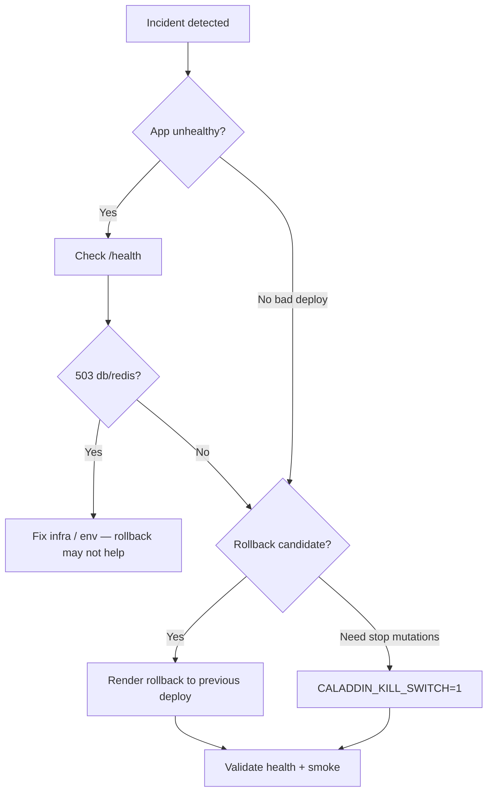

# Caladdin rollback runbook

Use this when a deploy causes regressions, health checks fail, or you need to stop mutations quickly without waiting for a code fix.

**Related:** [DEPLOYMENT.md](../DEPLOYMENT.md) · [MONITORING_SETUP.md](./MONITORING_SETUP.md) · [LOG_SHIPPING.md](./LOG_SHIPPING.md)

---

## Decision tree



---

## 1. Emergency: stop mutations (kill switch)

Fastest way to pause calendar writes and guest booking actions without redeploying.

1. **Render Dashboard** → **caladdin** web service → **Environment**.
2. Set `CALADDIN_KILL_SWITCH` = `1` → **Save** (triggers redeploy).
3. Affected routes return **503** with `{ "error": "paused" }`:
   - `POST /s/:token/select`
   - `POST /s/:token/cancel`
   - `POST /s/:token/reschedule`
   - Voice orchestration mutations (via `checkOperationAllowed`)

4. **Verify:**

   ```bash
   curl -s -o /dev/null -w "%{http_code}" -X POST \
     "$CALADDIN_BASE_URL/s/INVALID/select" \
     -H "Content-Type: application/json" \
     -d '{"slotIndex":0}'
   # Expect 404 or 503 — not 502 from GCal
   ```

5. **Restore:** set `CALADDIN_KILL_SWITCH` = `0` after fix is deployed.

---

## 2. Render deploy rollback (application)

Rollback reverts the **web service** to a previously successful Docker image. Cron services use separate deploy history — roll them back individually if a cron change caused the incident.

### Prerequisites

- Render Dashboard access to the Caladdin workspace
- Know the **last known-good deploy** (green health check, smoke test passed)

### Steps

1. **Render Dashboard** → **caladdin** (web service) → **Events** (or **Deploys**).
2. Find the last deploy with:
   - Status **Live** / succeeded before the bad deploy
   - Health check green on `/health`
3. Open that deploy → **Rollback to this deploy** (or **Redeploy** on the good commit).
4. Wait for deploy to reach **Live** (~2–5 min for Docker).
5. If cron jobs were changed in the bad release:
   - Repeat for **caladdin-session-expiry** and **caladdin-reminders**.
6. Run **health validation** (section 4) and **smoke checks** (section 5).

### What rollback does *not* undo

- Environment variable changes made in Dashboard (including kill switch)
- Database migrations already applied to Supabase
- External state: Google Calendar events, Resend emails already sent

### Roll forward (preferred after fix)

1. Merge fix to `main`.
2. Let `autoDeploy: true` (see `render.yaml`) deploy the new image.
3. Confirm health + smoke before closing the incident.

---

## 3. Database migration rollback policy

Caladdin migrations (`supabase/migrations/`) are **forward-only**. There are no paired `down` migrations.

| Scenario | Policy |
|----------|--------|
| Bad deploy, schema unchanged | **App rollback only** — no DB action |
| Migration applied, app incompatible | **Roll forward** — ship a fix migration or hotfix app |
| Migration corrupted data | **Manual SQL** in Supabase SQL editor with backup restore if needed |
| Need to revert migration 019–024 | **Not supported** — restore Supabase from snapshot (see below) |

### Phase 1+ migrations (apply order)

| File | Purpose |
|------|---------|
| `019_rls_policies.sql` | RLS policies |
| `020_sessions.sql` | Auth sessions table |
| `021_rate_limits.sql` | Distributed rate limits |
| `022_event_types.sql` | Event types |
| `023_booking_responses.sql` | Guest intake |
| `024_booking_reminders.sql` | Reminder queue |

### If a migration must be reversed

1. **Supabase Dashboard** → **Database** → **Backups** → restore to pre-migration snapshot (production: coordinate maintenance window).
2. Re-apply migrations in order after code is fixed: `npm run db:apply`.
3. Verify: `npm run db:status`.

**Never** delete migration files from the repo after they have run in production — add a new forward migration instead.

---

## 4. Health check validation

Render uses `healthCheckPath: /health` (`render.yaml`). Validate after every rollback or env change.

### Expected healthy response (200)

```bash
curl -s "$CALADDIN_BASE_URL/health" | jq .
```

```json
{
  "status": "ok",
  "db": "ok",
  "redis": "skipped",
  "version": "1.0.0",
  "uptime": 120
}
```

| Field | Healthy | Unhealthy (503) |
|-------|---------|-----------------|
| `status` | `ok` | `error` |
| `db` | `ok` | `error` |
| `redis` | `ok` or `skipped` | `error` when `REDIS_URL` set in production |

### Render health checker

1. **Dashboard** → **caladdin** → **Settings** → confirm **Health Check Path** = `/health`.
2. After rollback, **Metrics** → **Health check** should show success within 1–2 minutes.
3. Repeated failures → instance restart loop; check **Logs** for Postgres/Redis connection errors.

### Cron job health

Cron jobs do not expose `/health`; they exit 0 on success.

```bash
# Manual trigger after rollback
curl -s -X POST "$CALADDIN_BASE_URL/jobs/session-expiry" \
  -H "x-api-key: $CALADDIN_API_KEY"
# Expect: {"status":"complete","expired":<n>}
```

Check **caladdin-session-expiry** and **caladdin-reminders** → **Logs** in Render for `200` response bodies or `process.exit(1)` errors.

---

## 5. Post-rollback smoke checklist

Run against the rolled-back (or kill-switch) environment:

- [ ] `GET /health` → 200, `db: ok`
- [ ] `GET /auth/me` with valid session cookie → 200 (or redirect to OAuth if expired)
- [ ] `GET /book/{username}/{slug}` → 200 JSON for a known event type
- [ ] `GET /s/{valid-token}` → 200 HTML booking page
- [ ] `POST /jobs/reminders` with API key → 200 `status: complete`
- [ ] Render **Metrics** → 5xx rate back to baseline
- [ ] Log drain receiving lines (see [MONITORING_SETUP.md](./MONITORING_SETUP.md))

Record results in your incident ticket or `SMOKE_TEST.md` when available.

---

## 6. Incident communication template

```
Incident: [brief]
Action: Rolled back caladdin web to deploy <id> at <time>
        OR enabled CALADDIN_KILL_SWITCH=1
DB: No migration rollback / forward fix PR #___
Health: /health 200, db ok
Next: Root cause + forward deploy ETA
```

---

## Quick reference

| Action | Where | Time |
|--------|-------|------|
| App rollback | Render → caladdin → Rollback deploy | ~2–5 min |
| Stop mutations | `CALADDIN_KILL_SWITCH=1` | ~2 min (redeploy) |
| DB restore | Supabase backup restore | 15–60 min |
| Health verify | `curl $URL/health` | < 30 sec |
