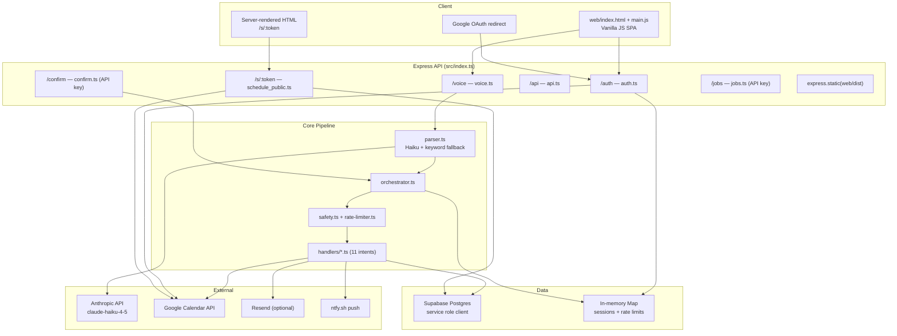

# Caladdin Production Readiness Audit Report

**Date:** 2026-06-07  
**Auditor:** Agent 1 — Code Auditor & Requirements Architect  
**Scope:** Full-stack audit of `C:\Users\Aniket-Laptop\OneDrive\Documents\Caladdin`  
**Test baseline:** `npm test` — **246 passed / 29 files** (44.5s)  
**Verdict:** Functional MVP voice-calendar agent with a working 2-slot booking loop, but **not production-ready** for enterprise scheduling. Architecture blocks horizontal scale; UI is prototype-grade; Cal.com/Calendly parity is ~15–25% on guest-facing scheduling features.

---

## 1. Current State Assessment

### 1.1 Architecture Diagram



### 1.2 Tech Stack

| Layer | Technology | Version / Notes |
|-------|------------|-----------------|
| Runtime | Node.js (ESM) | `type: "module"` in `package.json` |
| Language | TypeScript | 5.8.x, strict mode |
| HTTP Server | Express | 4.21.x |
| Build (API) | `tsc` → `dist/` | No bundler for backend |
| Build (Web) | Vite | 6.2.x — bundles 5 files (~14 KB total) |
| Frontend | **Vanilla JS** | No React/Vue; DOM manipulation in `web/main.js` |
| Database | Supabase Postgres | 11 migrations in `supabase/migrations/` |
| DB Client | `@supabase/supabase-js` | **Service role only** — `src/db/client.ts` |
| Auth | Google OAuth 2.0 | `src/services/auth_service.ts` |
| Calendar | `googleapis` | Primary calendar only; no Outlook/Apple |
| LLM | Anthropic SDK | `claude-haiku-4-5` tool-use in `src/core/parser.ts` |
| Validation | Zod | `src/core/adts.ts` schemas |
| Time | Luxon + custom `date-utils.ts` | Timezone-aware slot formatting |
| Email | Resend (optional) | `RESEND_API_KEY` in `.env.example` |
| Push | ntfy.sh | Host confirmations + booking notifications |
| Testing | Vitest 3.x | 31-file allowlist in `vitest.config.ts` |
| CI/CD | **None** | No `.github/workflows/`, no Dockerfile |
| Deploy docs | `DEPLOY.md` | Manual checklist for Render/Railway |

### 1.3 Project Structure

```
Caladdin/
├── src/                    # 64 TypeScript files — Express API + domain logic
│   ├── index.ts            # Entry: routes, static, compensation worker
│   ├── core/               # parser, orchestrator, safety, slot-scoring, intents
│   ├── handlers/           # 11 intent handlers
│   ├── routes/             # auth, voice, schedule_public, api, confirm, jobs
│   ├── db/                 # Supabase data access (14 modules)
│   ├── services/           # auth, calendar, gcal, email, notifications
│   ├── middleware/           # session, requestId, errorSanitizer
│   ├── jobs/               # compensation-worker, improvement-loop
│   └── pilot/              # kill switch, pilot cap
├── web/                    # 5 files — vanilla SPA (landing, onboarding, chat)
├── supabase/migrations/    # 11 SQL migrations (001–017, gaps in numbering)
├── tests/                  # 31 active + ~45 legacy + tests/tests/ duplicate tree
├── caladdin_spec_docs/       # Product spec and build plan
└── docs/production-readiness/  # This audit (new)
```

### 1.4 Duplicate / Broken Paths

| Issue | Location | Impact |
|-------|----------|--------|
| **Duplicate test tree** | `tests/tests/tests/**` + `tests/tests/__MACOSX/**` | 60+ junk/duplicate files; excluded in `vitest.config.ts` L22 |
| **Unmounted legacy router** | `src/routes/scheduling.ts` | Dead code; divergent booking implementation |
| **Legacy tests reference missing modules** | `tests/smoke/api-smoke.test.ts` → `src/constants.js`, `src/db/policies.js` | Broken if re-enabled |
| **Stale manifest** | `tests/AGENT1_TEST_MANIFEST.md` | Claims broader includes than `vitest.config.ts` |
| **Stale repo state** | `REPO_STATE.md` | Lists migrations only through `014`; actual through `017` |
| **Port mismatch** | `.env.example` uses `3001`; `config.ts` defaults `3000` | Local dev confusion |

---

## 2. Gap Analysis vs Production Standards

### 2.1 Error Handling

| Area | Current State | Gap |
|------|---------------|-----|
| Global errors | `errorSanitizer.ts` — generic 500 JSON | No error taxonomy, no Sentry/Datadog |
| Route handlers | `voice.ts:97-101` — `catch {}` swallows errors, returns 503 **without logging** | Production failures invisible |
| Orchestrator | try/catch with `logger.error` + user-facing `IntentResult` | Good pattern; inconsistent with routes |
| GCal failures | `compensation-worker.ts` retries every 60s | No dead-letter queue UI; in-process only |
| Confirmation re-exec | `confirmation-actions.ts:62-72` — returns HTTP 200 when execution fails | User thinks action succeeded |

### 2.2 Logging & Monitoring

| Capability | Status | Files |
|------------|--------|-------|
| Structured JSON logs | ✅ `src/logger.ts` | stdout only |
| Request IDs | ✅ `middleware/requestId.ts` | Propagated via `x-request-id` |
| Usage events | ✅ `db/usage_events.ts` | Swallows write errors (non-fatal) |
| Health endpoint | ✅ `GET /health` | No DB/GCal connectivity checks |
| APM / metrics | ❌ | No Prometheus, no uptime probes beyond `/health` |
| Alerting | ❌ | No PagerDuty/Opsgenie integration |
| Audit trail | Partial | `audit_log` table; not all mutations logged |

### 2.3 Authentication & Sessions

| Capability | Status | Details |
|------------|--------|---------|
| Google OAuth | ✅ | HMAC-signed state in `auth_service.ts` |
| Session cookies | ⚠️ | `middleware/session.ts` — **in-memory `Map`** |
| Session signing | ❌ | Token is `base64url(userId:timestamp:random)` — not HMAC'd |
| `SESSION_SECRET` | ❌ Unused | Defined in `config.ts:28` but never applied |
| API key auth | ✅ | `requireApiKey()` with `timingSafeEqual` |
| CSRF protection | ❌ | Relies on `sameSite: 'lax'` only |
| Multi-instance deploy | ❌ | Sessions lost on restart; no sticky sessions |

### 2.4 Rate Limiting

| Layer | Status | Details |
|-------|--------|---------|
| Intent mutations | ✅ | `core/rate-limiter.ts` — 20/hr per userId |
| HTTP routes | ❌ | No limit on `/voice`, `/auth`, `/s/*`, `/waitlist` |
| Public booking | ❌ | Spec requires `/s/*` rate limit; not wired |
| Distributed | ❌ | In-memory `Map` — per-process only |
| Brute-force OAuth | ❌ | No signup attempt throttling |

### 2.5 Validation

| Layer | Status | Files |
|-------|--------|-------|
| UUID / utterance | ✅ | `core/safety.ts` |
| Zod schemas | ✅ | `core/adts.ts` — `ParsedIntentSchema`, `UserPolicyProfileSchema` |
| Title sanitization | ✅ | `param-extract.ts` → `sanitizeTitle()` |
| Email (waitlist) | Basic regex | `routes/waitlist.ts` |
| Public booking body | Partial | `slotIndex` validated; no Zod on propose payload |
| Env validation | Partial | `config.ts` throws in prod for missing vars; not for weak secrets |

### 2.6 Database Security

| Capability | Status |
|------------|--------|
| Row Level Security (RLS) | **❌ None** — grep found zero `ENABLE ROW LEVEL SECURITY` in migrations |
| Service role for all queries | ⚠️ `db/client.ts` bypasses any DB-level auth |
| Parameterized queries | ✅ Supabase client (no raw SQL) |
| Connection pooling | ❌ Not configured |

---

## 3. Feature Completeness Matrix vs Cal.com / Calendly

| Feature | Cal.com/Calendly Baseline | Caladdin Status | Completeness | Key Files |
|---------|---------------------------|-----------------|--------------|-----------|
| Persistent event types | `/username/30min` URLs | ❌ Ephemeral voice-created sessions | ~5% | `handlers/offer-specific.ts` |
| Full availability grid | Day/week picker | ❌ Exactly 2 curated slots | ~10% | `core/slot-scoring.ts` |
| Guest booking page | Polished SPA | ⚠️ Server-rendered HTML | ~35% | `routes/schedule_public.ts` |
| Google Calendar sync | Bidirectional | ✅ Create + import + sync | ~70% | `services/calendar_api.ts` |
| Microsoft/Outlook | Standard | ❌ | 0% | — |
| Working hours / buffers | Admin UI | ⚠️ JSON policy only, no UI | ~40% | `core/adts.ts` `UserPolicyProfile` |
| Guest intake form | Name, email, custom Qs | ❌ Only `invitee_email` if known | ~10% | `scheduling_sessions` schema |
| Guest reschedule/cancel | Self-service links | ❌ No public routes | 0% | — |
| Email/SMS reminders | Automated | ❌ Link email only (Resend) | ~10% | `services/email.ts` |
| Team / round-robin | Multi-host routing | ❌ | 0% | — |
| Payments (Stripe) | Optional | ❌ (spec non-goal) | 0% | — |
| Video conferencing | Zoom/Meet auto-add | ❌ | 0% | — |
| Embeddable widget | iframe/script | ❌ | 0% | — |
| Webhooks / Booking API | Integrations | ❌ Only `GET /api/sessions` | ~5% | `routes/api.ts` |
| Guest timezone picker | Localized slots | ❌ Host timezone only | 0% | `schedule_public.ts:44` |
| ICS attachments | Calendar files | ❌ | 0% | — |
| Analytics dashboard | Booking funnel | ⚠️ `usage_events` table only | ~15% | `db/usage_events.ts` |
| Voice scheduling | N/A (differentiator) | ✅ OFFER_SPECIFIC intent | ~80% | `handlers/offer-specific.ts` |
| 2-slot "fax effect" | N/A (differentiator) | ✅ Scoring + top 2 | ~80% | `core/intents/offer-specific.ts` |
| Read-only host calendar | N/A (differentiator) | ✅ `/s/:token/calendar` | ~70% | `schedule_public.ts:137+` |
| Double-book prevention | Standard | ✅ Claim/finalize sentinel | ~85% | `db/scheduling_sessions.ts` |
| Destructive action confirm | N/A | ✅ ntfy + pending_confirmations | ~75% | `core/confirmation-actions.ts` |

**Overall Cal.com/Calendly parity: ~15–25%** on standard scheduling SaaS features. Caladdin's voice-first differentiators are ~70–85% built.

---

## 4. Performance Bottlenecks

### 4.1 Backend Hot Paths

| Bottleneck | File / Function | Issue |
|------------|-----------------|-------|
| **Synchronous LLM call per voice request** | `parser.ts` → `parseIntent()` | 10s timeout (`config.llmTimeoutMs`); blocks HTTP response |
| **Slot generation N+1 queries** | `slot-scoring.ts` → `generateSlots()` | Sequential: `listEvents` → `listBusyFromGCal` → `getUserByEmail` → `getOAuthClientForUser` → `listBusyFromGCal` (recipient) |
| **7-day slot iteration** | `slot-scoring.ts:72-80` | O(days × slots/day) loop; no caching of free/busy |
| **GCal import on OAuth** | `routes/auth.ts` callback | 2-week `importEventsFromGCal` blocks signup redirect |
| **In-process compensation worker** | `jobs/compensation-worker.ts` | 60s poll; competes with request handling on same Node process |
| **No connection pooling** | `db/client.ts` | New Supabase client singleton; no pg pool tuning |

### 4.2 Frontend

| Metric | Value | Notes |
|--------|-------|-------|
| Bundle size | **~14 KB** (gzip ~5 KB) | Trivial — not a bottleneck |
| No code splitting | `web/main.js` single chunk | Fine at current scale |
| Auto calendar query on chat open | `main.js:28,219-224` | Extra `/voice` call on every session start |
| No caching headers | `index.ts:42` static serve | Default Express static; no CDN strategy |

### 4.3 Database Query Patterns

| Pattern | File | Risk |
|---------|------|------|
| `select('*')` count for pilot cap | `pilot_controls.ts:24-28` | Full table scan as user count grows |
| No indexes documented | migrations | `scheduling_sessions.token` likely indexed; not verified for all FK lookups |
| JSONB blob reads | `conversation-context.ts`, `scheduling_sessions.ts` | Large frames parsed on every voice request |

---

## 5. Security Vulnerabilities & Compliance Gaps

### 5.1 OWASP Top 10 Mapping

| OWASP | Finding | Severity | Evidence |
|-------|---------|----------|----------|
| A01 Broken Access Control | Service role bypasses all DB auth; app-layer only | **Critical** | `db/client.ts`, no RLS |
| A01 | Public `/s/:token` endpoints unauthenticated — token is sole secret | High | `schedule_public.ts` |
| A02 Cryptographic Failures | Session tokens not signed; `SESSION_SECRET` unused | **Critical** | `middleware/session.ts:15` |
| A02 | Dev default secrets in `config.ts:28-29` | High | Not enforced in non-prod |
| A04 Insecure Design | In-memory state prevents secure multi-instance | **Critical** | sessions + rate limits |
| A05 Security Misconfiguration | No `helmet`, no `cors` policy, no CSP | Medium | `src/index.ts` |
| A07 Auth Failures | No brute-force protection on OAuth/waitlist | Medium | `routes/waitlist.ts` |
| A08 Data Integrity | Confirmation hash mismatch proceeds on session approve | Medium | `confirmation-actions.ts:44` |
| A09 Logging Failures | `voice.ts` catch block logs nothing | High | `voice.ts:97` |
| A10 SSRF | No user-controlled outbound URLs found | Low | — |

### 5.2 Compliance Gaps (Enterprise)

| Requirement | Status |
|-------------|--------|
| SOC 2 audit logging | Partial — `audit_log` exists; incomplete coverage |
| GDPR data export/delete | ❌ No user data export or account deletion flow |
| HIPAA | ❌ Not applicable without BAA; no PHI controls |
| PCI | N/A — no payments |
| Data residency | ❌ Not configurable (Supabase region fixed) |
| Secret rotation | ❌ No documented rotation for API keys/OAuth |

### 5.3 Active Security Test Coverage

`tests/security/red-team.test.ts` — 4 attacks:
- No session → 401 on `POST /voice`
- Utterance > 1000 chars → 400
- Session/userId mismatch → 403
- Health endpoint public

**Missing from active suite:** SQL injection (low risk with Supabase), double-approve replay, API key route tests, public booking abuse, rate limit bypass.

---

## 6. Scalability Limitations

| Limitation | Impact | Mitigation Required |
|------------|--------|-------------------|
| In-memory sessions | Cannot run >1 instance; sessions lost on deploy | Redis/DB-backed sessions |
| In-memory rate limiter | Limits not shared across instances | Redis rate limiter |
| Single Node process | Voice + worker + static + API colocated | Split worker; consider serverless functions |
| Synchronous LLM in request path | P99 latency tied to Anthropic | Queue + webhook/poll pattern |
| Service role DB client | Single key with full access | RLS + anon key for user-scoped reads |
| No CDN for static assets | Latency for global users | Cloudflare/Vercel edge |
| `MAX_PILOT_USERS` cap | Hard limit at 10 (`.env.example`) | Remove for GA; implement proper billing |

---

## 7. UX/UI Issues ("AI Slop" Assessment)

### 7.1 Main App (`web/`)

| Screen | Issue | File |
|--------|-------|------|
| Landing | Generic copy: "Talk to your calendar like you talk to a smart friend" | `web/index.html:13-14` |
| Landing | No favicon, OG tags, meta description | `web/index.html` |
| Onboarding | Timezone + privacy radios **never persisted to API** | `web/main.js:308-311` |
| Onboarding | Hardcoded `America/Chicago` default | `web/index.html:30` |
| Chat | Plain text bubbles only — no calendar cards, slot previews | `web/main.js` `addMessage()` |
| Chat | Auto-fires "What's on my calendar?" on every open | `web/main.js:28,219-224` |
| Chat | Confirm card duplicates bot message | `web/main.js:209` |
| Chat | `#reconnect-banner` in HTML but **never shown in JS** | `web/index.html:45-48` |
| Feedback | Emoji thumbs only (👍/👎) — no structured feedback | `web/index.html:72-73` |
| Auth errors | 401 silently redirects to landing | `web/main.js:195-197` |
| Pilot paused | `?pilot=paused` from auth redirect not handled | `routes/auth.ts:69` vs `main.js` |
| Desktop | 480px max-width — sparse on large screens | `web/styles.css:22-26` |

### 7.2 Public Booking (`src/routes/schedule_public.ts`)

| Issue | Evidence |
|-------|----------|
| Inline `<style>` — not shared design system | L90-99 vs `web/styles.css` |
| `system-ui` font — inconsistent with DM Sans/Fraunces | L91 |
| `alert()` for errors | L120, L130 |
| "Suggest another time" uses today's date + `'flexible'` — no real picker | L128 |
| False "host notified" alert — no notification sent | L130 vs no `sendHostBookingNotification` on propose |
| No loading states on slot selection | L112-121 |
| No guest name/email collection form | — |

### 7.3 Design System Gaps

- No component library (shadcn, Radix, etc.)
- No dark mode
- No responsive breakpoints beyond single column
- No accessibility audit (partial `aria-*` on mic button only)
- Three separate styling approaches: `web/styles.css`, inline in `schedule_public.ts`, inline in `invite.ts`

---

## 8. Existing Bugs & Edge Cases

| ID | Severity | Bug | Location |
|----|----------|-----|----------|
| B01 | Critical | `checkOperationAllowed()` defined but **never called** in `src/` — kill switch only at OAuth signup | `pilot/pilot_controls.ts:62` |
| B02 | Critical | `expireOpenSessions()` defined but **never scheduled** — expired sessions stay `pending` | `db/scheduling_sessions.ts:226` |
| B03 | High | `voice.ts:97` catch returns 503 without logging | `routes/voice.ts` |
| B04 | High | Confirmation approve returns 200 when re-execution fails | `confirmation-actions.ts:62-72` |
| B05 | High | `scheduling.ts` router unmounted — dead duplicate code path | `routes/scheduling.ts` vs `index.ts` |
| B06 | Medium | `posture` column (`strict`/`mutual`/`flexible`) unused in slot logic | migration `007`, `slot-scoring.ts` |
| B07 | Medium | `shareAvailabilityOnInvite` policy flag defined but not enforced | `core/adts.ts` |
| B08 | Medium | Guest propose alternative stored in DB but host not notified | `schedule_public.ts` propose handler |
| B09 | Medium | `recordInviteMetric()` empty stub | `db/platform_invites.ts` |
| B10 | Medium | Policy 404 edge case: new user without policy row may fail before `ensureDefaultPolicy()` | `routes/voice.ts:42-46` |
| B11 | Low | `checkIdempotency()` / `storeIdempotency()` have zero callers | `db/compensation_queue.ts:43` |
| B12 | Low | Unused imports in `handlers/offer-specific.ts` | `getPolicy`, `upsertPolicy` |
| B13 | Low | `.env.example` port 3001 vs `config.ts` default 3000 | config mismatch |

### Test Suite Health

- **Active:** 246/246 passing (29 files)
- **Excluded legacy:** ~45 tests at canonical paths (many reference removed modules)
- **Duplicate junk:** `tests/tests/__MACOSX/**` — should be deleted
- **No CI:** Tests run locally only

---

## 9. Priority Rankings

### Critical (P0) — Blocks production / enterprise sales

| ID | Item | Spec |
|----|------|------|
| C01 | Replace in-memory sessions with persistent store | Redis or `sessions` table; sign tokens with HMAC using `SESSION_SECRET`; 7-day TTL |
| C02 | Enable Supabase RLS + stop using service role for user-scoped reads | Policies per `user_id`; anon key for client; service role only for workers |
| C03 | Add CI/CD pipeline | GitHub Actions: `npm test`, `tsc`, lint; block merge on failure |
| C04 | Wire kill switch + pilot controls to all mutation paths | Call `checkOperationAllowed()` in `orchestrator.ts`, `schedule_public.ts` select, `auth.ts` callback |
| C05 | Fix silent error swallowing in voice route | Log in `voice.ts:97` catch; return structured error with `x-request-id` |
| C06 | Delete `tests/tests/` duplicate tree + `__MACOSX` junk | Git clean; update `.gitignore` for `__MACOSX` |
| C07 | Schedule `expireOpenSessions()` | Cron job or in-process interval in `jobs/` |
| C08 | Distributed rate limiting | Redis-backed limiter for `/voice` and `/s/*` |
| C09 | Build real booking UI (replace server-rendered HTML) | React/Next or polished SPA sharing design system with main app |
| C10 | Persistent event types + public booking URLs | New `event_types` table; `/u/:slug/:eventType` routes |

### High (P1) — Required for competitive scheduling product

| ID | Item |
|----|------|
| H01 | Guest intake form (name, email, custom questions) |
| H02 | Guest reschedule/cancel self-service |
| H03 | Email reminders (24h, 1h before) |
| H04 | Availability admin UI (working hours, buffers, blocked days) |
| H05 | Guest timezone detection/display |
| H06 | Remove dead `scheduling.ts`; consolidate booking paths |
| H07 | Persist onboarding timezone + privacy to `user_policies` |
| H08 | Re-enable and fix legacy test suite (or delete broken tests) |
| H09 | Add `helmet`, CSP, CORS configuration |
| H10 | Health check with DB + GCal connectivity probes |
| H11 | Confirmation re-exec failure → return 500 or partial success with clear UX |
| H12 | Host notification on guest propose alternative |
| H13 | Microsoft 365 calendar integration (enterprise blocker) |
| H14 | Webhooks for booking events |
| H15 | Structured logging → log aggregation (Datadog/Axiom) |

### Medium (P2) — Polish and scale

| ID | Item |
|----|------|
| M01 | Rich chat UI — calendar cards, slot previews in voice responses |
| M02 | Embeddable booking widget |
| M03 | Team/round-robin scheduling |
| M04 | Analytics dashboard from `usage_events` |
| M05 | ICS file generation for bookings |
| M06 | Async LLM parsing (queue pattern) |
| M07 | CDN for static assets |
| M08 | GDPR data export/delete endpoints |
| M09 | Dark mode + responsive desktop layout |
| M10 | Replace emoji feedback with structured form |
| M11 | Wire `checkIdempotency()` for GCal writes |
| M12 | Enforce `shareAvailabilityOnInvite` on calendar view |
| M13 | Use `posture` column in slot scoring |
| M14 | Stripe payments (if monetizing) |
| M15 | Zoom/Meet auto-add to events |

---

## 10. Requirements for Agents 2–6

### Agent 2: Architecture & Performance

**Mission:** Make Caladdin horizontally scalable and reduce P99 latency.

**Deliverables:**
1. **Session store migration** — Replace `middleware/session.ts` in-memory `Map` with Redis or Supabase `sessions` table. Sign tokens: `HMAC-SHA256(userId:timestamp:random, SESSION_SECRET)`. Files: `middleware/session.ts`, new `db/sessions.ts`, `config.ts`.
2. **Distributed rate limiter** — Extract `core/rate-limiter.ts` to Redis backend. Apply to `POST /voice` (10/min) and `POST /s/:token/select` (5/min per token). Keep intent-level 20/hr limit.
3. **Extract compensation worker** — Move `jobs/compensation-worker.ts` to standalone cron endpoint `POST /jobs/compensation-tick` (API key protected) or Render cron job.
4. **Slot generation optimization** — Cache GCal free/busy in Redis (5-min TTL). Parallelize `generateSlots()` queries in `core/slot-scoring.ts`. Target: <500ms P95.
5. **Async voice pipeline** — Optional: `POST /voice` returns `202` + `requestId`; client polls `GET /voice/status/:requestId`. Decouple LLM from HTTP thread.
6. **Health check depth** — Extend `GET /health` with `{ db: ok, redis: ok }` sub-checks.
7. **Delete dead code** — Remove `src/routes/scheduling.ts` after confirming `schedule_public.ts` parity.

**Acceptance criteria:**
- Two app instances share sessions (test with load balancer simulation)
- Rate limits persist across restarts
- `generateSlots()` P95 < 500ms with warm cache
- No in-memory state required for correctness

---

### Agent 3: Frontend & UX

**Mission:** Replace prototype UI with enterprise-grade scheduling UX competitive with Cal.com.

**Deliverables:**
1. **Framework migration** — Migrate `web/` to React + TypeScript + Tailwind + shadcn/ui. Keep Vite build. Preserve voice/STT in `speech-input.ts`.
2. **Design system** — Single token file shared with public booking pages. Fonts: keep DM Sans + Fraunces or upgrade to distinct pairing. Dark mode support.
3. **Screen rebuilds:**
   - Landing: hero, social proof, feature grid, proper SEO meta
   - Onboarding: persist timezone to `PATCH /api/profile`, privacy tier to `user_policies`
   - Chat: rich message types (calendar list cards, slot preview cards, confirmation modals)
   - Settings: working hours editor, buffer rules, notification preferences
4. **Public booking SPA** — Replace `schedule_public.ts` inline HTML with client-rendered booking flow at `/s/:token`. Include: slot cards, calendar view, guest form, timezone selector, loading states, toast errors (no `alert()`).
5. **Event type management UI** — CRUD for event types with duration, description, availability rules. Route: `/dashboard/event-types`.
6. **Fix dead UI** — Wire `#reconnect-banner` or remove. Handle `?pilot=paused`. Show 401 explanation before redirect.
7. **Accessibility** — WCAG 2.1 AA: focus rings, keyboard nav, screen reader labels on all interactive elements.

**Acceptance criteria:**
- Lighthouse Performance > 90, Accessibility > 95 on booking page
- Onboarding values persist and appear in `user_policies`
- Zero `alert()` calls in booking flow
- Consistent styling across `/`, `/s/:token`, `/invite/:token`

---

### Agent 4: Backend

**Mission:** Complete scheduling domain model and harden API layer.

**Deliverables:**
1. **Event types subsystem** — New migration `018_event_types.sql`: `event_types(id, user_id, slug, title, duration_minutes, description, availability_rules JSONB, active)`. CRUD routes in `routes/event_types.ts`. Public booking at `GET /book/:username/:slug`.
2. **Guest self-service** — `POST /s/:token/reschedule`, `POST /s/:token/cancel` with email verification token.
3. **Reminders** — `booking_reminders` table + cron job sending via Resend at T-24h, T-1h.
4. **Wire pilot controls** — Call `checkOperationAllowed('voice_mutation')` in `orchestrator.ts` before handlers; `checkOperationAllowed('calendar_write')` in `schedule_public.ts` select handler.
5. **Session expiry job** — Call `expireOpenSessions()` every 15 min from `jobs/` or cron.
6. **Host notification on propose** — `appendProposedAlternative()` → `sendHostBookingNotification()`.
7. **Fix confirmation re-exec** — `confirmation-actions.ts:62-72` return 500 with `executionStatus: 'failed'` or rollback approval status.
8. **Voice route logging** — Add `logger.error` in `voice.ts:97` catch with `requestId`, `userId`, error stack.
9. **Profile API** — `PATCH /api/profile` for timezone, display name, notification preferences.
10. **Webhooks** — `webhook_subscriptions` table; fire on `booking.confirmed`, `booking.cancelled`.

**Acceptance criteria:**
- Create event type → get permanent URL → guest books without voice command
- Guest can cancel via email link
- Reminder emails sent in test environment
- Kill switch blocks all mutations within 1 request

---

### Agent 5: Testing & QA

**Mission:** Establish reliable CI and comprehensive test coverage.

**Deliverables:**
1. **CI pipeline** — `.github/workflows/ci.yml`: Node 22, `npm ci`, `npm test`, `npm run build`. Fail on any red test.
2. **Clean test tree** — Delete `tests/tests/` and `tests/tests/__MACOSX/`. Add `__MACOSX/` to `.gitignore`.
3. **Re-enable legacy tests** — Triage 45 excluded tests. Fix imports (`middleware/auth.js` → `middleware/session.js`). Delete tests for removed modules. Target: 80+ active test files.
4. **New test coverage:**
   - `requireApiKey` on `/jobs`, `/confirm` (401 without key, 200 with key)
   - Rate limiter: 21st mutation returns rate-limit message
   - `expireOpenSessions()` integration
   - `checkOperationAllowed` wired in orchestrator
   - Public booking abuse: 100 rapid selects on same token
   - Confirmation re-exec failure path
5. **E2E smoke** — Playwright test: OAuth mock → voice command → scheduling link → guest books.
6. **Coverage gate** — CI fails if `src/handlers/` coverage < 60%.
7. **Fix stale docs** — Update `REPO_STATE.md`, `tests/AGENT1_TEST_MANIFEST.md` to match `vitest.config.ts`.

**Acceptance criteria:**
- CI green on every PR
- No duplicate test directories in repo
- Coverage report published as CI artifact
- Playwright E2E runs in CI (with mocked OAuth)

---

### Agent 6: Security & DevOps

**Mission:** Harden security posture and establish production deployment pipeline.

**Deliverables:**
1. **Supabase RLS** — Migration `019_rls_policies.sql`: enable RLS on `users`, `events`, `scheduling_sessions`, `user_policies`, `google_tokens`. Policies: `user_id = auth.uid()`. Refactor `db/client.ts` to support user-scoped anon client where appropriate.
2. **Security headers** — Add `helmet` to `src/index.ts`. CSP allowing Google Fonts, Anthropic (if needed). HSTS in production.
3. **CORS policy** — Explicit allowlist from `CALADDIN_BASE_URL`.
4. **Secret validation** — `config.ts` reject `SESSION_SECRET` / `OAUTH_STATE_SECRET` if < 32 chars in production.
5. **Session hardening** — Signed session tokens; optional rotation on privilege change.
6. **Deploy config** — `render.yaml` Blueprint: web service, env var groups, health check on `/health`, cron for session expiry + reminders.
7. **Dockerfile** — Multi-stage: build → slim Node 22 Alpine runtime. Non-root user.
8. **Monitoring** — Structured logs to stdout; document Datadog/Axiom integration. Alert on 5xx rate > 1%.
9. **GDPR endpoints** — `DELETE /api/account` (cascade delete user data), `GET /api/account/export`.
10. **Dependency audit** — `npm audit` in CI; pin critical deps.

**Acceptance criteria:**
- `npm audit` zero high/critical vulnerabilities
- RLS prevents cross-user data access (integration test)
- `render.yaml` deploys successfully to staging
- Security headers present on all responses (verified by test)

---

## Appendix A: Key File Index

| Path | Role |
|------|------|
| `src/index.ts` | Express entry, route mounting, static serve |
| `src/config.ts` | All env config and defaults |
| `src/core/orchestrator.ts` | Intent dispatch, safety gates |
| `src/core/parser.ts` | LLM + keyword intent parsing |
| `src/core/slot-scoring.ts` | Availability computation |
| `src/routes/voice.ts` | Main voice/text API |
| `src/routes/schedule_public.ts` | Active public booking |
| `src/routes/scheduling.ts` | **Dead** legacy booking |
| `src/middleware/session.ts` | In-memory sessions |
| `src/db/client.ts` | Supabase service role singleton |
| `web/main.js` | Client app logic |
| `vitest.config.ts` | Active test allowlist |
| `supabase/migrations/007_scheduling_sessions.sql` | Core booking table |

## Appendix B: Environment Variables

See `.env.example`. Production-critical: `ANTHROPIC_API_KEY`, `SUPABASE_URL`, `SUPABASE_SERVICE_ROLE_KEY`, `GOOGLE_OAUTH_*`, `CALADDIN_API_KEY`, `SESSION_SECRET`, `OAUTH_STATE_SECRET`, `CALADDIN_BASE_URL`.

## Appendix C: Test Run Summary (2026-06-07)

```
Test Files  29 passed (29)
     Tests  246 passed (246)
  Duration  44.49s
```

Slowest: `scheduling-public-routes.test.ts` (3.9s), `auth-oauth-mvp.test.ts` (2.9s), `orchestrator.test.ts`.
