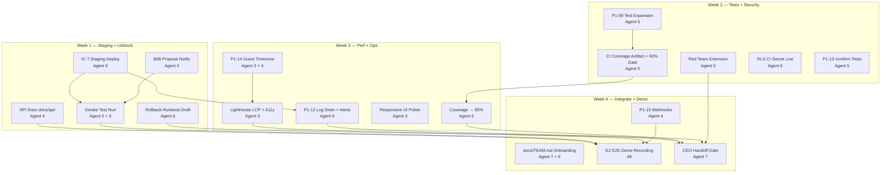

# Caladdin CEO Handoff Sprint — 4-Week Plan

**Chief Architect:** Agent 7  
**Date:** 2026-06-07  
**Sprint start:** 2026-06-09 (Monday)  
**Sprint end / CEO demo:** 2026-07-04 (Friday)  
**Entry state:** Phase 1 (G1) ✅ pass · Phase 2 (G2) 2/11 · CEO criteria 2/14 pass  
**Sources:** [FINAL_READINESS_REPORT.md](./FINAL_READINESS_REPORT.md), [MASTER_PLAN.md](./MASTER_PLAN.md), [PROGRESS_TRACKER.md](./PROGRESS_TRACKER.md)

---

## 1. Mission

Close the gap between **deployable staging MVP** and **CEO handoff bar**: Cal.com core booking parity, operational readiness, and measurable quality (coverage, performance, security, smoke validation).

**Non-goals this sprint:** Microsoft/Outlook sync, Stripe payments, team round-robin, embeddable widget, React migration (vanilla SPA acceptable if gates pass).

---

## 2. Exit Criteria — CEO Handoff Gate (CHG)

All four **hard quality gates** must pass before the CEO demo. All **14 handoff criteria** must reach **Pass** (no Partial/Fail).

### Hard Quality Gates

| Gate ID | Metric | Target | Owner | Verified By |
|---------|--------|--------|-------|-------------|
| **QG-Coverage** | Statement coverage (active suite) | **≥ 80%** | Agent 5 | CI artifact + local `npm run test:coverage` |
| **QG-Perf** | Lighthouse LCP on booking page | **< 2.5s** | Agent 3 | `docs/perf/lighthouse-booking.json` committed |
| **QG-Perf+** | Lighthouse Performance score | **≥ 90** | Agent 3 | Same artifact; Accessibility **≥ 95** |
| **QG-Bugs** | Open critical bugs | **0** | Agent 4 + 5 | [CEO_PROGRESS_TRACKER.md](./CEO_PROGRESS_TRACKER.md) B-list |
| **QG-Smoke** | Staging smoke protocol | **100% checked** | Agent 6 | `SMOKE_TEST.md` sign-off row in tracker |

**Exit rule:** Agent 7 blocks CEO demo if any QG is red, even if feature work is complete.

---

## 3. Agent Roster & Sprint Ownership

| Agent | Role | Sprint focus |
|-------|------|--------------|
| **2** | Architecture & Performance | Rate-limit tuning, slot perf baseline, health probe hardening, support QG-Perf investigations |
| **3** | Frontend & UX | Responsive polish, guest timezone (P1-14), Lighthouse/LCP, a11y keyboard audit |
| **4** | Backend | B08 propose-notify, P1-14 API, P1-15 webhooks, API docs content, bug fixes B06–B07 |
| **5** | Testing & QA | P1-09 expansion, CI coverage gate, red team extension, smoke test execution, QG-Coverage |
| **6** | Security & DevOps | Staging deploy (IC-7), monitoring live (P1-12), rollback runbook, RLS CI secret, npm audit |
| **7** | Chief Architect | Daily checkpoint review, merge order enforcement, CHG sign-off, CEO demo orchestration |

**Daily protocol:** Each agent posts standup to [CEO_PROGRESS_TRACKER.md](./CEO_PROGRESS_TRACKER.md) using the template at bottom. Agent 7 reviews at **16:00 UTC** daily checkpoints (Section 6).

---

## 4. Dependency Graph — CEO Sprint



**Legend:** Solid arrows = hard blocker for downstream work or gate.

---

## 5. Week-by-Week Plan

### Week 1 (Jun 9–13) — Staging Truth + Critical Path Bugs

**Theme:** Make staging the source of truth; fix known critical gaps; publish API reference.

| Agent | Mon–Tue | Wed–Thu | Fri | Deliverable |
|-------|---------|---------|-----|-------------|
| **6** | Deploy Render staging; apply migrations 019–024 | IC-7 checkpoint; env groups + cron verify | Rollback runbook draft in `docs/DEPLOYMENT.md` | Staging URL + `/health` green |
| **4** | **B08:** `sendHostBookingNotification` in propose handler | **B07** stub or enforce `shareAvailabilityOnInvite` | API docs: `docs/api/` (public + auth routes) | Propose-notify PR merged |
| **5** | Pair with Agent 6 on smoke prep | Execute `SMOKE_TEST.md` on staging (batch 1) | File smoke results in tracker | ≥ 50% smoke items checked |
| **3** | Responsive audit: booking grid @768px+ | Fix `--content-max` chat width on desktop | Baseline Lighthouse (pre-optimization) | Responsive fixes PR |
| **2** | Document slot-generation hot path | Support Agent 6 health/redis probe if needed | Buffer for Week 3 perf | Perf notes in `docs/perf/` |

**Week 1 merge order:** Agent 6 staging infra → Agent 4 B08 → Agent 3 responsive (no API deps) → Agent 5 smoke record.

---

### Week 2 (Jun 16–20) — Coverage Ramp + Security Proof

**Theme:** Expand test suite; CI coverage artifact; extended abuse tests.

| Agent | Mon–Tue | Wed–Thu | Fri | Deliverable |
|-------|---------|---------|-----|-------------|
| **5** | P1-09 batch 3: handlers + services | CI: upload coverage artifact; **60% handlers floor** | Red team: rate-limit bypass, double-approve, public booking abuse | 55+ active test files |
| **5** | P1-13: `/confirm/*` API key suite | Propose-notify integration test | | |
| **6** | `SUPABASE_TEST_DATABASE_URL` in GitHub secrets | RLS integration runs in CI | Resolve npm audit critical (vitest dev deps) | Full RLS in CI |
| **4** | **B06:** wire or document `posture` column | Support Agent 5 handler tests | Guest lifecycle hardening | 0 open P0/P1 bugs |
| **3** | P1-06 settings page scaffold (if time) | Else: a11y fixes (focus trap on confirm) | | |
| **2** | Rate limit tuning from abuse test feedback | | | |

**Week 2 checkpoint:** Coverage ≥ **60%** statements; propose-notify test green; CI artifact live.

---

### Week 3 (Jun 23–27) — Performance, Timezone, Monitoring

**Theme:** Prove LCP < 2.5s; guest timezone; operational monitoring.

| Agent | Mon–Tue | Wed–Thu | Fri | Deliverable |
|-------|---------|---------|-----|-------------|
| **3** | **P1-14:** timezone selector + slot display | Lighthouse optimizations (bundle, fonts, skeleton) | Commit `docs/perf/lighthouse-booking.json` | **QG-Perf pass** |
| **4** | P1-14 backend: slots JSON includes guest TZ | Support Lighthouse API latency | | |
| **6** | Attach Render log drain (Datadog/Axiom) | Configure 5xx > 1% alert | Verify cron logs in aggregator | **P1-12 operational** |
| **5** | P1-09 batch 4 → **80% coverage** | Complete smoke protocol (100%) | axe/Lighthouse a11y audit | **QG-Coverage + QG-Smoke** |
| **2** | Slot generation profiling; cache recommendations | | | |

**Week 3 checkpoint:** LCP < 2.5s documented; coverage ≥ **75%** (buffer for Week 4); monitoring alert fires on test 500.

---

### Week 4 (Jun 30 – Jul 4) — Webhooks, Docs, CEO Demo

**Theme:** Final integrations; team docs; recorded demo; CHG sign-off.

| Agent | Mon–Tue | Wed–Thu | Fri | Deliverable |
|-------|---------|---------|-----|-------------|
| **4** | **P1-15:** webhooks migration + dispatcher | HMAC tests for `booking.confirmed` / `cancelled` | Bug bash fixes only | G2-Webhooks pass |
| **5** | Coverage push to **80%** if below target | G2 checklist execution | CEO demo test script dry-run | **QG-Coverage final** |
| **6** | Finalize rollback + dedupe DEPLOY.md | Production env checklist (not go-live) | Staging sign-off record | Ops docs complete |
| **3** | P1-06 availability settings (complete or document deferral) | Demo UI polish | Record booking flow with CEO script | |
| **7** | `docs/TEAM.md` engineer onboarding | IC-8 / CHG review | **CEO demo** + handoff packet | CHG ✅ or explicit exceptions |

**Week 4 merge order:** Agent 4 webhooks → Agent 5 G2 tests → Agent 7 docs → demo (no feature merges after Thu 18:00 UTC).

---

## 6. Daily Checkpoints (16:00 UTC)

Agent 7 runs a **15-minute async review** against [CEO_PROGRESS_TRACKER.md](./CEO_PROGRESS_TRACKER.md).

| Day | Checkpoint ID | Required green items | Escalation trigger |
|-----|---------------|----------------------|-------------------|
| **Mon W1** | DC-W1-M | Staging deploy started; B08 PR open | Staging blocked > 4h |
| **Tue W1** | DC-W1-T | Staging `/health` ok; migrations applied | Any migration failure |
| **Wed W1** | **IC-7** | Staging URL shared; cron jobs listed | Missing env var |
| **Thu W1** | DC-W1-R | B08 merged; API docs PR open | Propose-notify still broken |
| **Fri W1** | DC-W1-F | Smoke ≥ 50%; rollback draft | Smoke < 30% |
| **Wed W2** | DC-W2-M | CI coverage artifact uploading | Coverage job failing |
| **Fri W2** | DC-W2-F | 60% coverage; red team +3 cases | Coverage < 55% |
| **Wed W3** | DC-W3-M | LCP measured (any value); log drain attached | No Lighthouse file |
| **Fri W3** | DC-W3-F | LCP < 2.5s; smoke 100%; coverage ≥ 75% | LCP > 3s |
| **Wed W4** | DC-W4-M | Webhooks PR merged or scoped down with CEO approval | Webhook blocker |
| **Fri W4** | **CHG** | All QG green; 14/14 criteria Pass | Any QG red → no demo |

---

## 7. Merge Order Rules (CEO Sprint)

### 7.1 Hard ordering

1. **Staging before smoke** — Agent 6 IC-7 before Agent 5 marks smoke items pass.
2. **B08 before propose E2E** — No guest-lifecycle demo until propose-notify merged.
3. **API docs before external review** — `docs/api/` before IC-8 demo script freeze (Wed W4).
4. **Coverage CI before 80% claim** — Agent 5 lands artifact before updating QG-Coverage checkbox.
5. **Lighthouse artifact before QG-Perf** — JSON in repo with date + URL + commit SHA.
6. **Webhooks after booking E2E** — P1-15 merges only after G2-E2E-Booking partial → pass.
7. **No migrations after Thu W4 12:00 UTC** — freeze schema for demo stability.

### 7.2 File ownership (unchanged from MASTER_PLAN §7.2)

| Area | Primary | CEO sprint notes |
|------|---------|------------------|
| `src/routes/schedule_public.ts` | Agent 4 | B08, P1-14 |
| `web/booking.js`, `web/booking.css` | Agent 3 | LCP, responsive, P1-14 |
| `.github/workflows/ci.yml`, `vitest.config.ts` | Agent 5 | Coverage gate |
| `render.yaml`, `docs/DEPLOYMENT.md` | Agent 6 | Rollback section |
| `docs/api/*` | Agent 4 | OpenAPI or markdown reference |
| `docs/perf/*` | Agent 3 | Lighthouse artifacts |

### 7.3 PR naming

```
[Agent-N][CEO-Wn] Short description
[Agent-4][B08] Propose handler host notification
[Agent-5][QG-Coverage] CI coverage artifact + 80% gate
```

---

## 8. Integration Checkpoints (CEO Sprint)

| ID | When | Participants | Agenda | Exit artifact |
|----|------|--------------|--------|---------------|
| **IC-7** | Wed W1 | 6 → All | Staging URL, env vars, cron, Redis/Postgres rate limits | URL in tracker |
| **IC-API** | Fri W1 | 4 → All | `docs/api/` walkthrough | API index merged |
| **IC-COV** | Fri W2 | 5 → 7 | Coverage report review; gap list for W3 | ≥ 60% confirmed |
| **IC-PERF** | Wed W3 | 3 → 7 | Lighthouse review; LCP budget | `lighthouse-booking.json` |
| **IC-OPS** | Fri W3 | 6 → 7 | Log drain + alert proof | Screenshot or log link |
| **IC-8 / CHG** | Fri W4 | All | G2 + 14 criteria + QG checklist | CEO demo recording |

---

## 9. Risk Register

| Risk | Impact | Mitigation | Owner |
|------|--------|------------|-------|
| 80% coverage not reachable in 4 weeks | CHG fail | Prioritize handlers/services; defer P2 tests; interim 75% requires CEO exception | 5 + 7 |
| LCP dominated by backend slot API | Perf gate fail | Agent 2 cache free/busy; Agent 3 skeleton UI; CDN static assets | 2 + 3 |
| Resend sandbox blocks reminder proof | G2-Reminders partial | Record sandbox send logs; mark criterion Pass with sandbox evidence | 4 + 6 |
| Webhooks scope creep | W4 slip | MVP: `booking.confirmed` only; cancel webhook Week 5 if needed | 4 + 7 |
| Vanilla vs React plan drift | Review noise | CEO sprint accepts vanilla SPA if QG-Perf and a11y pass | 7 |

---

## 10. CEO Demo Script (Fri W4)

1. Host creates event type → copies `/book/:username/:slug`
2. Guest opens link → sees slots in **guest timezone** → books with name/email
3. Host receives notification; guest receives confirmation email
4. Guest proposes alternative → **host notified** (B08)
5. Guest reschedules via email link
6. Show `/health`, staging logs, CI coverage badge
7. Show rollback doc (simulate kill switch `CALADDIN_KILL_SWITCH=1`)

Recording stored: `docs/demo/ceo-handoff-2026-07-04.md` (link + attendees + CHG result).

---

## 11. Related Documents

| Document | Purpose |
|----------|---------|
| [CEO_PROGRESS_TRACKER.md](./CEO_PROGRESS_TRACKER.md) | Live checkboxes — 14 criteria + Cal.com parity + QG |
| [FINAL_READINESS_REPORT.md](./FINAL_READINESS_REPORT.md) | Baseline assessment |
| [MASTER_PLAN.md](./MASTER_PLAN.md) | Original 6-week plan (Phase 1 complete) |
| [AGENT_ASSIGNMENTS.md](./AGENT_ASSIGNMENTS.md) | File-level acceptance criteria |
| [PROGRESS_TRACKER.md](./PROGRESS_TRACKER.md) | P0/P1 item status |
| [SMOKE_TEST.md](../../SMOKE_TEST.md) | Staging smoke protocol |

---

*Orchestrated by Agent 7. Update this plan only via Agent 7 approval when scope or dates change.*
