# Caladdin Production Transformation — Master Plan

**Chief Architect:** Agent 7  
**Date:** 2026-06-07  
**Sources:** [AUDIT_REPORT.md](./AUDIT_REPORT.md), [PRIORITIZED_ACTION_ITEMS.md](./PRIORITIZED_ACTION_ITEMS.md), [CALADDIN_FULL_APPLICATION_SPEC.md](../../caladdin_spec_docs/CALADDIN_FULL_APPLICATION_SPEC.md) Part 12  
**Audience:** Agents 2–6 (parallel implementers)

---

## 1. Mission

Transform Caladdin from a functional MVP voice-calendar agent into an enterprise-ready scheduling product. Phase 1 (Weeks 1–2) unblocks production deploy. Phase 2 (Weeks 3–6) delivers Cal.com/Calendly competitive parity on core booking flows.

**Non-goals for Phase 1:** React migration, event types, guest self-service — those are Phase 2.

---

## 2. Architectural Decisions (Binding for All Agents)

These decisions are **final for Phase 1**. Do not introduce alternatives without Agent 7 approval.

| Decision | Choice | Rationale |
|----------|--------|-----------|
| **Session store** | Supabase `sessions` table + HMAC-signed cookie tokens | No new infra dependency in Week 1; co-locates auth state with user data; Redis reserved for ephemeral counters |
| **Session token format** | `base64url(userId:timestamp:nonce).hmac-sha256` signed with `SESSION_SECRET` | Fixes unsigned-token vulnerability (Audit A02); store `token_hash` in DB, never raw token |
| **Rate limiting backend** | Redis (Upstash-compatible) sliding window | Must survive restart and share across instances; separate from session persistence |
| **RLS pattern** | `current_setting('app.user_id')::uuid` via `setUserContext(userId)` per request | Service role sets context before queries; policies on all user-scoped tables |
| **DB client split** | Service role **only** for: cron jobs, compensation worker, session expiry, waitlist admin | User-scoped routes use service role + `setUserContext`; anon key deferred to Phase 3 |
| **Migration numbering** | `019_rls_policies.sql` (Agent 6), `020_sessions.sql` (Agent 2) | Agent 6 lands first; Agent 2 must not use migration numbers < 019 |
| **CI structure** | GitHub Actions: Node 22 → `npm ci` → `npm test` → `npm run build` | Single workflow file; no deploy in CI until P1-11 |
| **Cron pattern (MVP)** | In-process interval in `src/index.ts` for expiry; extract to `POST /jobs/*` + Render cron in P1-11 | Agent 4 ships in-process first; Agent 6 wires Render cron later |
| **Frontend (Phase 1)** | Keep vanilla `web/` — no React migration until Phase 2 | Agent 3 starts React scaffold in Week 3 only |
| **Public booking (Phase 1)** | Keep server-rendered `schedule_public.ts`; helmet CSP must allow inline styles on `/s/*` | SPA migration is P1-02 in Phase 2 |

---

## 3. Dependency Graph — All P0 & P1 Items

```mermaid
flowchart TD
  subgraph P0_Foundation["Phase 1 — P0 Foundation (Week 1–2)"]
    P003["P0-03 CI Pipeline<br/>Agent 5"]
    P002["P0-02 RLS Policies<br/>Agent 6"]
    P009["P0-09 Security Headers<br/>Agent 6"]
    P001["P0-01 Persistent Sessions<br/>Agent 2"]
    P007["P0-07 Distributed Rate Limit<br/>Agent 2"]
    P008["P0-08 Delete Dead Router<br/>Agent 2"]
    P004["P0-04 Kill Switch Wiring<br/>Agent 4"]
    P005["P0-05 Voice Error Logging<br/>Agent 4"]
    P006["P0-06 Session Expiry Job<br/>Agent 4"]
    P010["P0-10 Confirmation Re-exec Fix<br/>Agent 4"]
  end

  subgraph P1_Product["Phase 2 — P1 Competitive Parity (Week 3–6)"]
    P101["P1-01 Event Types + URLs<br/>Agent 4 + 3"]
    P102["P1-02 Public Booking SPA<br/>Agent 3"]
    P103["P1-03 Guest Intake Form<br/>Agent 3 + 4"]
    P104["P1-04 Guest Reschedule/Cancel<br/>Agent 4"]
    P105["P1-05 Email Reminders<br/>Agent 4"]
    P106["P1-06 Availability Admin UI<br/>Agent 3"]
    P107["P1-07 Onboarding Persist<br/>Agent 3 + 4"]
    P108["P1-08 Host Propose Notify<br/>Agent 4"]
    P109["P1-09 Re-enable Legacy Tests<br/>Agent 5"]
    P110["P1-10 Health Check Depth<br/>Agent 2"]
    P111["P1-11 Deploy Blueprint<br/>Agent 6"]
    P112["P1-12 Structured Log Shipping<br/>Agent 6"]
    P113["P1-13 API Key Route Tests<br/>Agent 5"]
    P114["P1-14 Guest Timezone Display<br/>Agent 3"]
    P115["P1-15 Webhooks<br/>Agent 4"]
  end

  %% P0 internal dependencies
  P003 --> P109
  P003 --> P113
  P002 --> P001
  P002 --> P101
  P001 --> P110
  P007 --> P110

  %% P0 → P1
  P002 --> P101
  P009 --> P102
  P006 --> P105
  P006 --> P111
  P001 --> P102
  P003 --> P111

  %% P1 internal chain
  P101 --> P102
  P101 --> P106
  P101 --> P103
  P102 --> P103
  P102 --> P114
  P103 --> P104
  P107 --> P106
  P111 --> P112
  P111 --> P105
  P004 --> P109

  %% Cross-agent soft deps
  P010 -.-> P102
  P005 -.-> P112
```



**Legend:** Solid arrows = hard blocker. Dotted = soft (can proceed with stub, must integrate before gate).

---

## 4. Week-by-Week Timeline — Agents 2–6

### Week 1 — Foundation Sprint A

| Agent | Mon–Tue | Wed–Thu | Fri | Deliverable |
|-------|---------|---------|-----|-------------|
| **5** | P0-03: `.github/workflows/ci.yml` | Delete `tests/tests/`, update `.gitignore` | Verify CI green on main | CI badge live |
| **6** | P0-02: `019_rls_policies.sql` draft | `setUserContext()` in `db/client.ts` | P0-09: helmet + CSP | RLS migration + headers PR |
| **4** | P0-04 kill switch, P0-05 voice logging | P0-06 expiry interval, P0-10 confirmation fix | Integration tests for P0-04/05/10 | Backend hardening PR |
| **2** | P0-08 delete `scheduling.ts` | P0-01: `020_sessions.sql` + `db/sessions.ts` | P0-07: Redis rate limiter scaffold | Sessions + cleanup PR |

**Week 1 checkpoint (Friday):** CI green; kill switch wired; voice errors logged; dead router deleted.

### Week 2 — Foundation Sprint B + Integration

| Agent | Mon–Tue | Wed–Thu | Fri | Deliverable |
|-------|---------|---------|-----|-------------|
| **5** | Tests for P0-04, P0-05, P0-06 | RLS cross-user integration test (with Agent 6) | 2-instance session smoke test (with Agent 2) | P0 test coverage PR |
| **6** | RLS integration test fixes | Refactor 2–3 `db/*` modules to use `setUserContext` | Security header tests | RLS complete PR |
| **4** | Host propose notify stub (prep P1-08) | `PATCH /api/profile` scaffold (prep P1-07) | Fix merge conflicts from Agent 2/6 | Backend ready for Phase 2 |
| **2** | P0-07: wire limits to `/voice`, `/s/:token/select` | P0-01: 2-instance session test | P1-10: health check depth (early) | Scale-ready PR |

**Phase 1 gate (End Week 2):** All P0 items ✅; see Section 5.

### Week 3 — Event Types & Frontend Scaffold

| Agent | Focus | Items |
|-------|-------|-------|
| **4** | Event types backend | P1-01: migration `021_event_types.sql`, CRUD routes |
| **3** | React + Vite scaffold in `web/` | Design tokens, shadcn init; no booking flow yet |
| **5** | P1-09 legacy test triage (batch 1) | Fix imports, expand vitest allowlist |
| **6** | P1-11: `render.yaml` + `Dockerfile` draft | Staging deploy config |
| **2** | P1-10 health check polish | Redis probe in `/health` |

### Week 4 — Booking SPA Core

| Agent | Focus | Items |
|-------|-------|-------|
| **4** | P1-03 backend (guest responses table), P1-07 `PATCH /api/profile` | API for intake + onboarding |
| **3** | P1-02 booking SPA at `/s/:token`, P1-14 timezone display | Replace inline HTML |
| **5** | P1-13 API key route tests | `/jobs`, `/confirm` auth tests |
| **6** | P1-11 staging deploy validation | Health check + env groups |
| **2** | Support Agent 3 API integration | CORS review with Agent 6 |

### Week 5 — Guest Lifecycle & Admin UI

| Agent | Focus | Items |
|-------|-------|-------|
| **4** | P1-04 reschedule/cancel, P1-05 reminders, P1-08 propose notify | Guest self-service + cron |
| **3** | P1-06 availability admin UI, P1-03 guest intake UI | Settings + booking form |
| **5** | P1-09 legacy tests (batch 2), coverage gate prep | Target 60+ active files |
| **6** | P1-12 log shipping docs + alert config | Datadog/Axiom runbook |
| **2** | Buffer/support | Rate limit tuning from E2E feedback |

### Week 6 — Integration & Phase 2 Gate

| Agent | Focus | Items |
|-------|-------|-------|
| **4** | P1-15 webhooks | HMAC-signed booking events |
| **3** | P1-01 event type admin UI (`/dashboard/event-types`) | CRUD screens |
| **5** | P1-09 completion, E2E smoke prep | 80+ test files target |
| **6** | Staging sign-off, secret validation hardening | Production deploy checklist |
| **2** | Performance baseline | Slot generation profiling report |

**Phase 2 gate (End Week 6):** End-to-end booking flow; see Section 5.

---

## 5. Quality Gates per Phase

### Phase 1 Gate — Production-Unblock (End Week 2)

Derived from Audit P0 list + [CALADDIN_FULL_APPLICATION_SPEC.md](../../caladdin_spec_docs/CALADDIN_FULL_APPLICATION_SPEC.md) §12.1 + [Definition of Done](./PRIORITIZED_ACTION_ITEMS.md#definition-of-done-enterprise-ready).

| Gate | Criteria | Verified By |
|------|----------|-------------|
| **G1-CI** | `npm test` + `npm run build` pass in GitHub Actions on every PR | Agent 5 |
| **G1-RLS** | Integration test: User A cannot read User B's `events` or `scheduling_sessions` | Agent 5 + 6 |
| **G1-Session** | Two Node processes share session; restart does not invalidate cookie | Agent 2 + 5 |
| **G1-RateLimit** | 21st voice mutation returns rate-limit; limit survives process restart | Agent 2 + 5 |
| **G1-KillSwitch** | `CALADDIN_KILL_SWITCH=1` blocks voice mutations AND public booking select | Agent 4 + 5 |
| **G1-Observability** | Voice 503 includes `x-request-id`; error logged with `requestId`, `userId` | Agent 4 + 5 |
| **G1-Expiry** | Session past `expires_at` → `expired` within 15 min | Agent 4 + 5 |
| **G1-Confirmation** | Re-exec failure returns non-success; confirmation remains retryable | Agent 4 + 5 |
| **G1-Security** | `curl -I` shows helmet headers on `/`, `/voice`, `/s/:token` | Agent 6 + 5 |
| **G1-CleanRepo** | Zero files under `tests/tests/`; `__MACOSX/` in `.gitignore` | Agent 5 |
| **G1-Regression** | Existing 246 tests still pass; no validation weakening | All agents |

**Exit rule:** All 11 gates green before any agent starts Phase 2 feature work (except Agent 3 design-token scaffold in Week 3 is allowed in parallel if zero backend contract changes).

### Phase 2 Gate — Competitive Parity (End Week 6)

| Gate | Criteria | Verified By |
|------|----------|-------------|
| **G2-E2E-Booking** | Create event type → permanent URL → guest books with name/email → host sees booking | Agent 3 + 4 + 5 |
| **G2-GuestLifecycle** | Guest cancels via email link; reschedule updates GCal event | Agent 4 + 5 |
| **G2-Reminders** | T-24h and T-1h reminder emails sent in test env (Resend sandbox) | Agent 4 + 5 |
| **G2-UI-Quality** | Booking page Lighthouse: Performance > 90, Accessibility > 95 | Agent 3 |
| **G2-NoAlerts** | Zero `alert()` in booking flow; toast-based errors | Agent 3 |
| **G2-Onboarding** | Timezone + privacy persist to `user_policies` via `PATCH /api/profile` | Agent 3 + 4 |
| **G2-Availability** | Working hours edit in settings affects slot generation | Agent 3 + 4 |
| **G2-Deploy** | `render.yaml` deploys to staging; `/health` returns `{ db: ok }` | Agent 6 |
| **G2-Tests** | 60+ active test files; API key routes tested; coverage report in CI artifact | Agent 5 |
| **G2-Webhooks** | `booking.confirmed` webhook fires with valid HMAC signature | Agent 4 + 5 |
| **G2-Spec** | Red team suite extended: rate limit bypass, double-approve, public booking abuse | Agent 5 |

### Ongoing Pre-Merge Gates (All Phases)

From spec §12.1 — apply to **every PR**:

- All tests pass (`npm test`)
- No weakening validations to pass tests
- Contract tests updated when intent/handler shapes change
- Schema migrations reviewed by Agent 6 before merge
- No secrets in committed files

---

## 6. Integration Checkpoints

Scheduled sync points to prevent drift. Agent 7 orchestrates; agents post status to `PROGRESS_TRACKER.md`.

| Checkpoint | When | Participants | Agenda |
|------------|------|--------------|--------|
| **IC-0 Kickoff** | Day 1 | All | Confirm architectural decisions (Section 2); assign migration numbers |
| **IC-1 CI Live** | Week 1 Wed | Agent 5 → All | CI green; all agents rebase onto main |
| **IC-2 RLS Contract** | Week 1 Thu | Agent 6 + 2 + 4 | `setUserContext()` API frozen; db module refactor list agreed |
| **IC-3 Session + RLS** | Week 2 Tue | Agent 2 + 6 | Sessions table works under RLS; service-role path for session lookup documented |
| **IC-4 Phase 1 Gate** | Week 2 Fri | All | Run G1-* checklist; block Phase 2 if any red |
| **IC-5 Event Type API** | Week 3 Wed | Agent 4 → 3 | OpenAPI/shape review for `event_types` CRUD + public booking URL |
| **IC-6 Booking SPA** | Week 4 Wed | Agent 3 + 6 | CSP updated for React bundle; drop inline-style exceptions |
| **IC-7 Deploy Staging** | Week 5 Tue | Agent 6 + All | Staging env vars, cron jobs, Redis URL verified |
| **IC-8 Phase 2 Gate** | Week 6 Fri | All | Run G2-* checklist; demo recorded |

---

## 7. Conflict Resolution & Merge Order

### 7.1 Hard Ordering Rules

1. **RLS before service-role removal (P0-02 → all db refactors)**  
   Agent 6 must merge `019_rls_policies.sql` and `setUserContext()` before any agent removes service-role calls or adds user-scoped query paths. Agent 2's session store may use service role + explicit user lookup until RLS policies cover `sessions` table.

2. **CI before feature PRs (P0-03 first)**  
   Agent 5 should land CI within 48 hours. All other agents target branches with CI enabled.

3. **Security headers before SPA (P0-09 before P1-02)**  
   Agent 6 ships permissive CSP for server-rendered `/s/*` in Week 1. Agent 3 must coordinate CSP tightening when React booking SPA lands in Week 4 (IC-6).

4. **Kill switch before load tests (P0-04 before P1-09 abuse tests)**  
   Agent 5's public booking abuse tests assume kill switch is wired.

5. **Event types backend before frontend (P1-01 API before P1-01 UI)**  
   Agent 4 merges migration + routes before Agent 3 builds `/dashboard/event-types`.

6. **Session expiry before reminders cron (P0-06 before P1-05)**  
   Shared cron infrastructure in `render.yaml` depends on expiry job pattern from Agent 4.

### 7.2 File Ownership (Avoid Merge Conflicts)

| File / Area | Primary Owner | Secondary (read-only until primary merges) |
|-------------|---------------|---------------------------------------------|
| `src/middleware/session.ts`, `src/db/sessions.ts` | Agent 2 | Agent 6 (signing review) |
| `src/db/client.ts`, `supabase/migrations/019_*` | Agent 6 | Agent 2, 4 |
| `src/core/rate-limiter.ts` | Agent 2 | Agent 4 |
| `src/core/orchestrator.ts`, `src/routes/voice.ts` | Agent 4 | Agent 2 (rate limit middleware) |
| `src/routes/schedule_public.ts` | Agent 4 | Agent 3 (Phase 2 replaces) |
| `src/index.ts` | Agent 6 (helmet) → Agent 4 (jobs) → Agent 2 (health) | Coordinate via IC |
| `web/*` | Agent 3 | Agent 4 (API shapes only) |
| `.github/workflows/ci.yml`, `vitest.config.ts` | Agent 5 | All (propose changes via Agent 5) |
| `render.yaml`, `Dockerfile` | Agent 6 | Agent 4 (cron entries) |

### 7.3 Migration Sequence

```
019_rls_policies.sql     — Agent 6 (Week 1)
020_sessions.sql         — Agent 2 (Week 1)
021_event_types.sql      — Agent 4 (Week 3)
022_booking_responses.sql — Agent 4 (Week 4, if separate from 021)
023_booking_reminders.sql — Agent 4 (Week 5)
024_webhook_subscriptions.sql — Agent 4 (Week 6)
```

Agents must not claim migration numbers out of sequence. Reserve `025+` for hotfixes.

### 7.4 Redis vs Supabase Boundary

| Use Redis | Use Supabase |
|-----------|--------------|
| HTTP rate limit counters | Session persistence |
| GCal free/busy cache (P2-09) | User data, policies, bookings |
| Optional: idempotency keys (P2-12) | Audit log, usage events |

**Do not** store sessions in Redis unless Agent 7 approves a change request.

---

## 8. Risk Register

| Risk | Impact | Mitigation |
|------|--------|------------|
| RLS breaks existing tests | CI red, blocks all | Agent 6 adds test helper `withUserContext(userId, fn)` first |
| Redis unavailable in dev | Rate limits fail open/closed? | **Fail closed** in production; in-memory fallback **dev only** with `NODE_ENV=development` |
| React migration breaks voice/STT | Core differentiator broken | Agent 3 preserves `speech-input.ts`; voice tests run before SPA merge |
| Migration conflict (two agents, same number) | Deploy failure | IC-0 assigns numbers; PR title must include migration ID |
| CSP blocks Google OAuth | Auth broken | Agent 6 whitelist `accounts.google.com` in `connect-src` |

---

## 9. Communication Protocol

- **Status updates:** Agents update [PROGRESS_TRACKER.md](./PROGRESS_TRACKER.md) daily.
- **Blockers:** Mark item `🔴 Blocked` with dependency ID; escalate to Agent 7 at IC or immediately if > 4 hours blocked.
- **PR naming:** `[Agent-N][P0-XX] Short description` — e.g. `[Agent-6][P0-02] Add RLS policies`.
- **Do not implement** items assigned to another agent without explicit Agent 7 redirect.

---

## 10. Related Documents

| Document | Purpose |
|----------|---------|
| [AGENT_ASSIGNMENTS.md](./AGENT_ASSIGNMENTS.md) | File-level tasks and acceptance criteria |
| [PROGRESS_TRACKER.md](./PROGRESS_TRACKER.md) | Live checklist |
| [PRIORITIZED_ACTION_ITEMS.md](./PRIORITIZED_ACTION_ITEMS.md) | Item specs |
| [AUDIT_REPORT.md](./AUDIT_REPORT.md) | Baseline findings |
