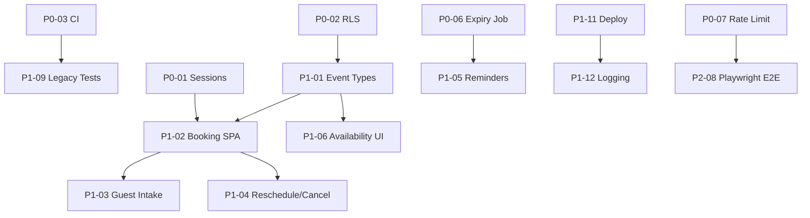

# Caladdin Prioritized Action Items

**Date:** 2026-06-07  
**Source:** [AUDIT_REPORT.md](./AUDIT_REPORT.md)  
**Purpose:** Ranked, actionable specs for Agents 2–6  
**Execution model:** Sequential phases with parallel work within phases where noted

---

## Executive Priority Tiers

| Tier | Definition | Count | Timeline Guidance |
|------|------------|-------|-------------------|
| **P0 Critical** | Blocks production deploy or creates data/security risk | 10 | Week 1–2 |
| **P1 High** | Required for Cal.com/Calendly competitive parity | 15 | Week 3–6 |
| **P2 Medium** | Polish, scale, enterprise compliance | 15 | Week 7–12 |

---

## P0 Critical — Do First

### P0-01: Persistent Session Store
- **Agent:** 2 (Architecture)
- **Files:** `src/middleware/session.ts`, new `src/db/sessions.ts`, `supabase/migrations/020_sessions.sql`
- **Problem:** In-memory `Map` in `session.ts:12` loses sessions on restart; breaks multi-instance deploys; `SESSION_SECRET` unused.
- **Spec:**
  1. Create `sessions` table: `token_hash`, `user_id`, `email`, `created_at`, `expires_at`
  2. Replace `createSession()` to store HMAC-signed token: `sign(userId:ts:nonce, SESSION_SECRET)`
  3. `getSession()` validates signature before DB lookup
  4. TTL: 7 days (match current cookie `maxAge`)
- **Acceptance:** Two Node processes share session; restart does not log users out
- **Effort:** 2–3 days

### P0-02: Supabase Row Level Security
- **Agent:** 6 (Security)
- **Files:** new `supabase/migrations/019_rls_policies.sql`, `src/db/client.ts`
- **Problem:** Service role key bypasses all DB auth; single key compromise = full data breach.
- **Spec:**
  1. `ALTER TABLE ... ENABLE ROW LEVEL SECURITY` on: `users`, `events`, `user_policies`, `scheduling_sessions`, `google_tokens`, `pending_confirmations`
  2. Policy: `user_id = current_setting('app.user_id')::uuid` for SELECT/INSERT/UPDATE/DELETE
  3. Service role retained only for: compensation worker, session expiry job, waitlist admin
  4. Add `setUserContext(userId)` wrapper that sets `app.user_id` per request
- **Acceptance:** Integration test proves user A cannot read user B's events
- **Effort:** 3–4 days

### P0-03: CI/CD Pipeline
- **Agent:** 5 (Testing)
- **Files:** new `.github/workflows/ci.yml`
- **Problem:** No automated test gate; 45 legacy tests excluded; duplicate test tree in repo.
- **Spec:**
  1. Workflow: `npm ci` → `npm test` → `npm run build` on push/PR to main
  2. Node 22, cache npm
  3. Fail PR if any test fails
  4. Delete `tests/tests/` directory entirely
  5. Add `__MACOSX/` to `.gitignore`
- **Acceptance:** Green CI badge; no duplicate test paths in repo
- **Effort:** 1 day

### P0-04: Wire Kill Switch to All Mutations
- **Agent:** 4 (Backend)
- **Files:** `src/core/orchestrator.ts`, `src/routes/schedule_public.ts`, `src/pilot/pilot_controls.ts`
- **Problem:** `checkOperationAllowed()` exists but is **never called** in `src/` — only tested in isolation.
- **Spec:**
  1. At top of `orchestrate()`: `await checkOperationAllowed('voice_mutation')` — return graceful failure if blocked
  2. In `POST /s/:token/select` handler: `checkOperationAllowed('calendar_write')`
  3. Map `pilot_full` reason correctly (currently mislabeled as `kill_switch_active` in `pilot_controls.ts:76`)
- **Acceptance:** Set `CALADDIN_KILL_SWITCH=1` → all voice mutations and bookings blocked with user message
- **Effort:** 0.5 day

### P0-05: Fix Voice Route Silent Errors
- **Agent:** 4 (Backend)
- **Files:** `src/routes/voice.ts:97-101`
- **Problem:** Empty `catch {}` returns 503 without logging — production failures are invisible.
- **Spec:**
  ```typescript
  } catch (err) {
    logger.error('Voice pipeline failed', { requestId, userId, error: String(err) });
    res.status(503).setHeader('Retry-After', '30').json({ ... });
  }
  ```
- **Acceptance:** Test verifies 503 response includes `x-request-id`; log line emitted
- **Effort:** 0.5 day

### P0-06: Schedule Session Expiry Job
- **Agent:** 4 (Backend)
- **Files:** `src/db/scheduling_sessions.ts:226`, `src/jobs/` or `src/index.ts`
- **Problem:** `expireOpenSessions()` never called — expired links stay bookable in DB.
- **Spec:**
  1. Call `expireOpenSessions()` every 15 minutes
  2. In-process interval for MVP; extract to cron endpoint for scale
  3. Log count of expired sessions per run
- **Acceptance:** Session past `expires_at` transitions to `expired` status within 15 min
- **Effort:** 0.5 day

### P0-07: Distributed Rate Limiting
- **Agent:** 2 (Architecture)
- **Files:** `src/core/rate-limiter.ts`, `src/routes/voice.ts`, `src/routes/schedule_public.ts`
- **Problem:** In-memory rate limiter resets on restart; not shared across instances; no HTTP-level limits.
- **Spec:**
  1. Redis-backed sliding window (or Upstash)
  2. `POST /voice`: 30 req/min per userId
  3. `POST /s/:token/select`: 10 req/min per token
  4. Keep intent mutation limit (20/hr) on Redis backend
- **Acceptance:** Rate limit survives process restart; shared across 2 instances
- **Effort:** 2 days

### P0-08: Delete Dead Scheduling Router
- **Agent:** 2 (Architecture)
- **Files:** `src/routes/scheduling.ts` (delete), verify `src/routes/schedule_public.ts` parity
- **Problem:** Unmounted duplicate with divergent booking logic causes confusion.
- **Spec:**
  1. Audit `scheduling.ts` for any logic not in `schedule_public.ts`
  2. Port missing pieces if any
  3. Delete file; grep repo for imports
- **Acceptance:** `grep scheduling.ts` returns zero; all booking tests still pass
- **Effort:** 0.5 day

### P0-09: Security Headers
- **Agent:** 6 (Security)
- **Files:** `src/index.ts`, `package.json` (add `helmet`)
- **Problem:** No CSP, HSTS, X-Frame-Options, etc.
- **Spec:**
  1. `app.use(helmet({ contentSecurityPolicy: { ... } }))`
  2. Allow Google Fonts, inline styles on `/s/*` (until SPA migration)
  3. `Strict-Transport-Security` in production
- **Acceptance:** `curl -I` shows security headers; tests verify presence
- **Effort:** 1 day

### P0-10: Confirmation Re-exec Failure Handling
- **Agent:** 4 (Backend)
- **Files:** `src/core/confirmation-actions.ts:62-72`
- **Problem:** Returns HTTP 200 with `executionStatus: 'failed'` — user believes destructive action completed.
- **Spec:**
  1. On re-exec failure: return 500 or 200 with `success: false` and rollback confirmation to `pending`
  2. Log failure with token, intent, error
  3. Update `web/main.js` confirm handler to show failure state
- **Acceptance:** Failed re-exec shows error in chat UI; confirmation remains retryable
- **Effort:** 1 day

---

## P1 High — Competitive Parity

### P1-01: Event Types + Persistent Booking URLs
- **Agent:** 4 (Backend) + 3 (Frontend)
- **Priority rank:** #1 among P1 (foundational for everything else)
- **Spec:** `event_types` table; CRUD API; public URL `/book/:username/:slug`; admin UI
- **Effort:** 5–7 days (split across agents)

### P1-02: Public Booking SPA
- **Agent:** 3 (Frontend)
- **Spec:** Replace `schedule_public.ts` inline HTML with React booking flow; shared design system; no `alert()`
- **Depends on:** P0-09 (CSP), design tokens from Agent 3
- **Effort:** 5 days

### P1-03: Guest Intake Form
- **Agent:** 3 + 4
- **Spec:** Name, email, optional custom questions on booking page; store in `scheduling_sessions` or new `booking_responses` table
- **Effort:** 2 days

### P1-04: Guest Reschedule / Cancel
- **Agent:** 4
- **Spec:** `POST /s/:token/cancel`, `POST /s/:token/reschedule`; email verification; GCal event delete/update
- **Effort:** 3 days

### P1-05: Email Reminders
- **Agent:** 4
- **Spec:** `booking_reminders` table; cron at T-24h and T-1h via Resend; unsubscribe link
- **Effort:** 2 days

### P1-06: Availability Admin UI
- **Agent:** 3
- **Spec:** Settings page for working hours, buffers, blocked days, minimum notice; writes to `user_policies.profile`
- **Effort:** 3 days

### P1-07: Persist Onboarding Data
- **Agent:** 3 + 4
- **Files:** `web/main.js:308-311`, new `PATCH /api/profile`
- **Spec:** Timezone + privacy tier saved to DB on "Get started"; used in slot scoring
- **Effort:** 1 day

### P1-08: Host Notification on Propose Alternative
- **Agent:** 4
- **Files:** `src/routes/schedule_public.ts` propose handler
- **Spec:** After `appendProposedAlternative()`, call `sendHostBookingNotification()` with guest's proposed time
- **Effort:** 0.5 day

### P1-09: Re-enable Legacy Tests
- **Agent:** 5
- **Spec:** Triage 45 excluded tests; fix broken imports; delete tests for removed modules; expand `vitest.config.ts` include
- **Target:** 80+ active test files
- **Effort:** 3–4 days

### P1-10: Health Check Depth
- **Agent:** 2
- **Files:** `src/index.ts` `/health` handler
- **Spec:** Return `{ status, db, version, uptime }`; DB ping via `SELECT 1`; fail 503 if DB down
- **Effort:** 0.5 day

### P1-11: Deploy Blueprint
- **Agent:** 6
- **Files:** new `render.yaml`, `Dockerfile`
- **Spec:** Web service, env groups, health check, cron jobs for expiry + reminders
- **Effort:** 2 days

### P1-12: Structured Log Shipping
- **Agent:** 6
- **Spec:** Document + configure stdout → Datadog/Axiom; alert on error rate > 1%
- **Effort:** 1 day

### P1-13: API Key Route Tests
- **Agent:** 5
- **Spec:** Tests for `/jobs/*` and `/confirm/*` — 401 without key, 200 with valid key
- **Effort:** 0.5 day

### P1-14: Guest Timezone Display
- **Agent:** 3
- **Spec:** Detect browser timezone; show slots in guest TZ alongside host TZ
- **Effort:** 1 day

### P1-15: Webhooks
- **Agent:** 4
- **Spec:** `webhook_subscriptions` table; HMAC-signed payloads on `booking.confirmed`, `booking.cancelled`
- **Effort:** 3 days

---

## P2 Medium — Polish & Scale

### P2-01: Rich Chat Message Types
- **Agent:** 3
- **Spec:** Calendar list cards, slot preview cards, inline scheduling link previews in chat
- **Effort:** 3 days

### P2-02: Async Voice Pipeline
- **Agent:** 2
- **Spec:** `POST /voice` → 202 + poll pattern; reduces P99 latency perception
- **Effort:** 3 days

### P2-03: Microsoft 365 Calendar
- **Agent:** 4
- **Spec:** OAuth + Graph API; calendar sync parity with Google
- **Effort:** 7–10 days

### P2-04: Team / Round-Robin Scheduling
- **Agent:** 4
- **Spec:** `team_members` table; collective availability; host rotation
- **Effort:** 7 days

### P2-05: Embeddable Widget
- **Agent:** 3
- **Spec:** `<script>` embed for booking button + inline calendar
- **Effort:** 3 days

### P2-06: Analytics Dashboard
- **Agent:** 3
- **Spec:** Charts from `usage_events`: bookings, conversion, popular times
- **Effort:** 3 days

### P2-07: GDPR Endpoints
- **Agent:** 6
- **Spec:** `DELETE /api/account`, `GET /api/account/export`
- **Effort:** 2 days

### P2-08: Playwright E2E
- **Agent:** 5
- **Spec:** Full flow: mock OAuth → voice → link → guest book; runs in CI
- **Effort:** 3 days

### P2-09: Slot Generation Cache
- **Agent:** 2
- **Spec:** Redis cache for GCal free/busy (5-min TTL); parallel queries in `generateSlots()`
- **Effort:** 2 days

### P2-10: Dark Mode + Desktop Layout
- **Agent:** 3
- **Spec:** CSS variables for dark theme; responsive breakpoints > 768px
- **Effort:** 2 days

### P2-11: ICS Attachments
- **Agent:** 4
- **Spec:** Generate `.ics` on booking confirmation email
- **Effort:** 1 day

### P2-12: Wire Idempotency Keys
- **Agent:** 4
- **Files:** `src/db/compensation_queue.ts`
- **Spec:** Call `checkIdempotency()` before GCal writes; `storeIdempotency()` after success
- **Effort:** 1 day

### P2-13: Enforce shareAvailabilityOnInvite
- **Agent:** 4
- **Spec:** Check policy flag before rendering `/s/:token/calendar`
- **Effort:** 0.5 day

### P2-14: Structured Feedback Form
- **Agent:** 3
- **Spec:** Replace emoji thumbs with category + comment form
- **Effort:** 1 day

### P2-15: CDN for Static Assets
- **Agent:** 6
- **Spec:** Cloudflare or Vercel edge for `web/dist`; cache headers
- **Effort:** 1 day

---

## Agent Assignment Matrix

| Agent | Role | P0 Items | P1 Items | P2 Items |
|-------|------|----------|----------|----------|
| **Agent 2** | Architecture & Performance | P0-01, P0-07, P0-08 | P1-10 | P2-02, P2-09 |
| **Agent 3** | Frontend & UX | — | P1-01, P1-02, P1-03, P1-06, P1-07, P1-14 | P2-01, P2-05, P2-06, P2-10, P2-14 |
| **Agent 4** | Backend | P0-04, P0-05, P0-06, P0-10 | P1-01, P1-03, P1-04, P1-05, P1-08, P1-15 | P2-03, P2-04, P2-11, P2-12, P2-13 |
| **Agent 5** | Testing & QA | P0-03 | P1-09, P1-13 | P2-08 |
| **Agent 6** | Security & DevOps | P0-02, P0-09 | P1-11, P1-12 | P2-07, P2-15 |

---

## Recommended Execution Order

### Phase 1: Foundation (Week 1–2) — Unblock Production
**Parallel tracks:**

```
Track A (Agent 5):  P0-03 CI pipeline + test tree cleanup
Track B (Agent 6):  P0-02 RLS + P0-09 security headers
Track C (Agent 4):  P0-04 kill switch + P0-05 voice logging + P0-06 expiry job + P0-10 confirmation fix
Track D (Agent 2):  P0-01 sessions + P0-07 rate limiting + P0-08 delete dead router
```

**Gate:** All P0 items complete; CI green; 2-instance session test passes.

### Phase 2: Core Product (Week 3–5) — Scheduling Parity
**Sequential dependency chain:**

```
1. Agent 4: P1-01 event types backend (API + migration)
2. Agent 3: P1-02 booking SPA + P1-06 availability UI (depends on #1)
3. Agent 3+4: P1-03 guest intake + P1-07 onboarding persist (parallel)
4. Agent 4: P1-04 reschedule/cancel + P1-05 reminders + P1-08 propose notify
5. Agent 5: P1-09 legacy tests + P1-13 API key tests
6. Agent 6: P1-11 deploy blueprint + P1-12 logging
```

**Gate:** End-to-end: create event type → share URL → guest books with form → receives reminder.

### Phase 3: Enterprise & Polish (Week 6–12)
**Parallel by agent specialty:**

```
Agent 2: P1-10 health depth → P2-09 slot cache → P2-02 async voice
Agent 3: P1-14 timezone → P2-01 rich chat → P2-10 dark mode → P2-05 embed
Agent 4: P1-15 webhooks → P2-11 ICS → P2-12 idempotency → P2-03 M365
Agent 5: P2-08 Playwright E2E
Agent 6: P2-07 GDPR → P2-15 CDN
```

---

## Dependency Graph



---

## Quick Reference: Top 10 Critical Items

| Rank | ID | Title | Agent | Effort |
|------|-----|-------|-------|--------|
| 1 | P0-02 | Supabase RLS | 6 | 3–4d |
| 2 | P0-01 | Persistent sessions | 2 | 2–3d |
| 3 | P0-03 | CI/CD pipeline | 5 | 1d |
| 4 | P0-07 | Distributed rate limiting | 2 | 2d |
| 5 | P0-04 | Wire kill switch | 4 | 0.5d |
| 6 | P0-05 | Fix voice silent errors | 4 | 0.5d |
| 7 | P0-09 | Security headers (helmet) | 6 | 1d |
| 8 | P0-06 | Session expiry job | 4 | 0.5d |
| 9 | P0-10 | Confirmation re-exec fix | 4 | 1d |
| 10 | P0-08 | Delete dead scheduling router | 2 | 0.5d |

**Combined P0 effort:** ~12–14 engineering days (parallelizable to ~1–2 weeks with 4 agents).

---

## Definition of Done: Enterprise-Ready

Caladdin is "enterprise-ready" when ALL of the following are true:

- [ ] CI green on every PR with 80+ test files
- [ ] RLS enforced; service role scoped to workers only
- [ ] Sessions + rate limits survive restart and scale to 3+ instances
- [ ] Persistent event types with public booking URLs
- [ ] Guest can book, reschedule, cancel without host intervention
- [ ] Email reminders sent automatically
- [ ] Booking UI passes Lighthouse A11y > 95
- [ ] Kill switch blocks all mutations within 1 request
- [ ] Deploy reproducible via `render.yaml` + Dockerfile
- [ ] Security headers on all responses
- [ ] No `alert()` in any user-facing flow
- [ ] Structured logs shipped to aggregation with alerting
